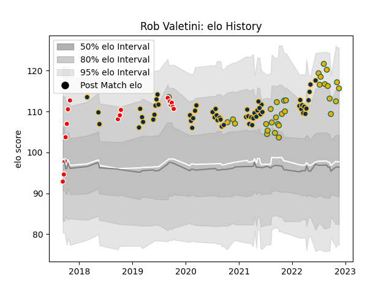

---  
layout: page  
title: Rob Valetini  
date: 2022-11-22 11:35:32.670460  
categories: player  
---
# Rob Valetini

## Positions: FL, N8

## Country: Australia

## Current elo: 116.0

## Current Percentile: 91.0

# Elo History

# Match History

| Team             |   Appearances |   Win Rate |
|:-----------------|--------------:|-----------:|
| Brumbies         |            55 |   0.690909 |
| Australia        |            31 |   0.467742 |
| Canberra Vikings |            16 |   0.75     |

| Opponent                 |   Matches |   Win Rate |
|:-------------------------|----------:|-----------:|
| Queensland Reds          |        10 |  0.5       |
| Melbourne Rebels         |         9 |  0.555556  |
| Western Force            |         8 |  0.875     |
| New South Wales Waratahs |         8 |  1         |
| Argentina                |         7 |  0.714286  |
| New Zealand              |         6 |  0.0833333 |
| Fijian Drua              |         5 |  0.8       |
| South Africa             |         4 |  0.75      |
| France                   |         4 |  0.5       |
| England                  |         4 |  0.25      |
| Chiefs                   |         4 |  0.75      |
| Sunwolves                |         3 |  1         |
| NSW Country Eagles       |         3 |  0.666667  |
| Highlanders              |         3 |  0.333333  |
| Brisbane City            |         3 |  0.666667  |
| Sydney Rays              |         2 |  1         |
| Blues                    |         2 |  0         |
| Hurricanes               |         2 |  1         |
| Melbourne Rising         |         2 |  1         |
| Scotland                 |         2 |  0.5       |
| Samoa                    |         1 |  1         |
| Sharks                   |         1 |  1         |
| Wales                    |         1 |  0         |
| Crusaders                |         1 |  0         |
| Perth Spirit             |         1 |  1         |
| Bulls                    |         1 |  1         |
| Japan                    |         1 |  1         |
| Jaguares                 |         1 |  0         |
| Ireland                  |         1 |  0         |
| Greater Sydney Rams      |         1 |  1         |
| Lions                    |         1 |  0         |