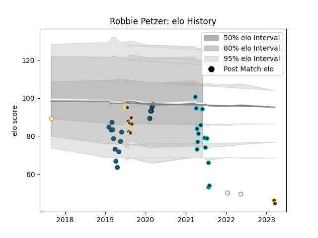

---  
layout: page  
title: Robbie Petzer  
date: 2023-03-21 17:59:52.720967  
categories: player  
---
# Robbie Petzer

Last updated: 2023-03-21
## Positions: C, FH

## Current elo: 94.0

## Current Percentile: 24.0

# Elo History

# Match History

| Team                |   Appearances |   Win Rate |
|:--------------------|--------------:|-----------:|
| Rugby ATL           |            14 |   0.642857 |
| Glendale Raptors    |            11 |   0.545455 |
| Griffons            |            11 |   0.5      |
| Colorado Raptors    |             5 |   0.4      |
| Pumas               |             2 |   0        |
| Free State Cheetahs |             1 |   1        |

| Opponent               |   Matches |   Win Rate |
|:-----------------------|----------:|-----------:|
| NOLA Gold              |         4 |      0.5   |
| Utah Warriors          |         4 |      0.875 |
| San Diego Legion       |         4 |      0.375 |
| Houston SaberCats      |         4 |      0.5   |
| Old Glory DC           |         2 |      0.5   |
| Toronto Arrows         |         2 |      1     |
| Eastern Province Kings |         2 |      1     |
| Jaguares XV            |         2 |      0     |
| L. A. Giltinis         |         2 |      0.5   |
| Rugby New York         |         2 |      0.5   |
| R.U. New York          |         2 |      0.5   |
| Valke                  |         1 |      0.5   |
| Seattle Seawolves      |         1 |      0     |
| SWD Eagles             |         1 |      0.5   |
| Austin Elite Rugby     |         1 |      1     |
| New England Free Jacks |         1 |      1     |
| Natal Sharks           |         1 |      0     |
| Austin Gilgronis       |         1 |      0     |
| Leopards               |         1 |      1     |
| Golden Lions           |         1 |      1     |
| Free State Cheetahs    |         1 |      0     |
| Border Bulldogs        |         1 |      1     |
| Boland Cavaliers       |         1 |      0.5   |
| Blue Bulls             |         1 |      0     |
| Western Province       |         1 |      0     |