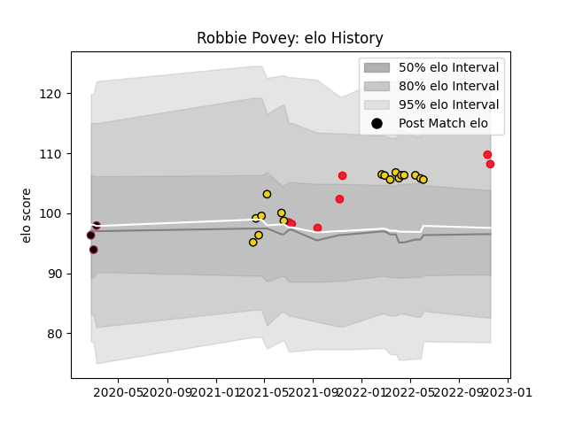

---  
layout: page  
title: Robbie Povey  
date: 2022-11-22 11:28:25.246907  
categories: player  
---
# Robbie Povey

## Positions: FB, FH

## Country: Canada

## Current elo: 108.0

## Current Percentile: 84.0

# Elo History

# Match History

| Team              |   Appearances |   Win Rate |
|:------------------|--------------:|-----------:|
| Houston SaberCats |            17 |   0.352941 |
| Canada            |             7 |   0.285714 |
| Utah Warriors     |             3 |   0.5      |

| Opponent                 |   Matches |   Win Rate |
|:-------------------------|----------:|-----------:|
| Austin Gilgronis         |         3 |   0        |
| Utah Warriors            |         3 |   0.666667 |
| Seattle Seawolves        |         3 |   0.666667 |
| L. A. Giltinis           |         3 |   0        |
| Dallas Jackals           |         2 |   1        |
| San Diego Legion         |         2 |   0.5      |
| Portugal                 |         1 |   0        |
| United States of America |         1 |   0        |
| Rugby ATL                |         1 |   0        |
| Namibia                  |         1 |   0        |
| Netherlands              |         1 |   1        |
| Austin Herd              |         1 |   0.5      |
| NOLA Gold                |         1 |   0        |
| England                  |         1 |   0        |
| Colorado Raptors         |         1 |   0        |
| Belgium                  |         1 |   1        |
| Wales                    |         1 |   0        |