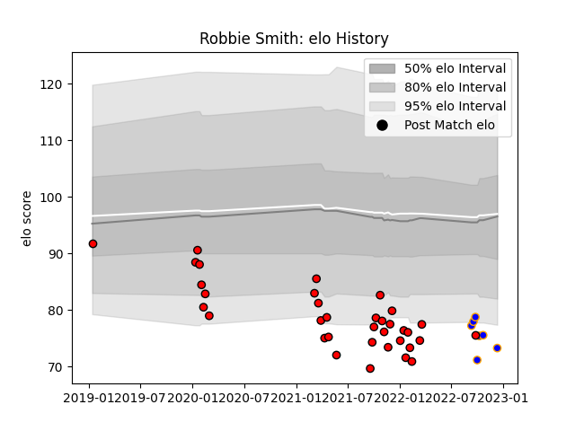

---  
layout: page  
title: Robbie Smith  
date: 2023-01-06 11:43:45.965447  
categories: player  
---
# Robbie Smith

## Positions: C, W

## Current elo: 79.0

## Current Percentile: 2.0

# Elo History

# Match History

| Team             |   Appearances |   Win Rate |
|:-----------------|--------------:|-----------:|
| Hartpury College |            37 |   0.283784 |
| Doncaster        |             8 |   0.625    |

| Opponent            |   Matches |   Win Rate |
|:--------------------|----------:|-----------:|
| Ealing Trailfinders |         6 |   0        |
| Bedford             |         5 |   0.4      |
| Jersey              |         5 |   0        |
| Nottingham          |         5 |   0.4      |
| Ampthill            |         4 |   0.25     |
| Coventry            |         4 |   0.5      |
| London Scottish     |         4 |   0.625    |
| Richmond            |         4 |   0.75     |
| Cornish Pirates     |         3 |   0.333333 |
| Doncaster           |         2 |   0        |
| Caldy               |         1 |   1        |
| Hartpury College    |         1 |   1        |
| Newcastle Falcons   |         1 |   0        |