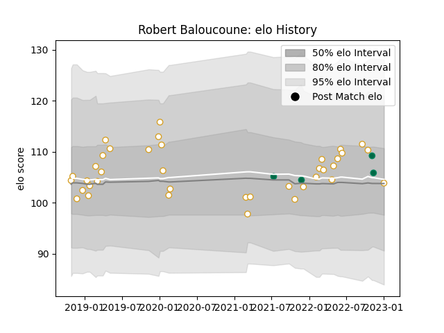

---  
layout: page  
title: Robert Baloucoune  
date: 2023-01-06 00:22:51.253398  
categories: player  
---
# Robert Baloucoune

## Positions: W

## Country: Ireland

## Current elo: 104.0

## Current Percentile: 58.0

# Elo History

# Match History

| Team    |   Appearances |   Win Rate |
|:--------|--------------:|-----------:|
| Ulster  |            38 |   0.697368 |
| Ireland |             4 |   1        |

| Opponent                 |   Matches |   Win Rate |
|:-------------------------|----------:|-----------:|
| Munster                  |         6 |   0.5      |
| Connacht                 |         5 |   0.8      |
| Leinster                 |         3 |   0.333333 |
| Ospreys                  |         3 |   0.333333 |
| Dragons                  |         3 |   1        |
| Edinburgh                |         2 |   1        |
| Zebre                    |         2 |   1        |
| Benetton Treviso         |         2 |   0.75     |
| Racing 92                |         1 |   1        |
| United States of America |         1 |   1        |
| Stormers                 |         1 |   0        |
| Southern Kings           |         1 |   1        |
| South Africa             |         1 |   1        |
| Sharks                   |         1 |   1        |
| Scarlets                 |         1 |   0        |
| Clermont Auvergne        |         1 |   0        |
| Cheetahs                 |         1 |   1        |
| Cardiff Blues            |         1 |   1        |
| Lions                    |         1 |   1        |
| Bath Rugby               |         1 |   1        |
| Leicester Tigers         |         1 |   1        |
| Glasgow Warriors         |         1 |   1        |
| Fiji                     |         1 |   1        |
| Argentina                |         1 |   1        |