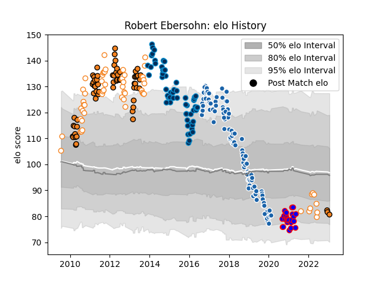

---  
layout: page  
title: Robert Ebersohn  
date: 2023-01-23 15:33:09.511977  
categories: player  
---
# Robert Ebersohn

## Positions: C

## Current elo: 81.0

## Current Percentile: 13.0

# Elo History

# Match History

| Team                |   Appearances |   Win Rate |
|:--------------------|--------------:|-----------:|
| Castres Olympique   |            98 |   0.5      |
| Cheetahs            |            64 |   0.429688 |
| Montpellier Herault |            60 |   0.575    |
| Free State Cheetahs |            56 |   0.589286 |
| Beziers             |            24 |   0.395833 |

| Opponent                   |   Matches |   Win Rate |
|:---------------------------|----------:|-----------:|
| Racing 92                  |        13 |   0.307692 |
| Toulon                     |        12 |   0.25     |
| La Rochelle                |        10 |   0.35     |
| Clermont Auvergne          |        10 |   0.6      |
| Blue Bulls                 |        10 |   0.75     |
| Stade Toulousain           |        10 |   0.6      |
| Golden Lions               |        10 |   0.45     |
| Pau                        |        10 |   0.5      |
| Griquas                    |        10 |   0.8      |
| Western Province           |         9 |   0.444444 |
| Bordeaux Begles            |         9 |   0.666667 |
| Natal Sharks               |         9 |   0.222222 |
| Grenoble                   |         8 |   0.875    |
| Stade Francais Paris       |         8 |   0.375    |
| Agen                       |         7 |   0.714286 |
| Montpellier Herault        |         7 |   0.428571 |
| Stormers                   |         7 |   0.142857 |
| Sharks                     |         7 |   0.285714 |
| Lyon                       |         7 |   0.714286 |
| Brive                      |         7 |   0.428571 |
| Oyonnax                    |         6 |   0.5      |
| Bayonne                    |         6 |   0.75     |
| Bulls                      |         6 |   0        |
| Lions                      |         5 |   0.6      |
| Pumas                      |         5 |   0.8      |
| Castres Olympique          |         4 |   0.5      |
| New South Wales Waratahs   |         4 |   0.75     |
| Brumbies                   |         4 |   0.25     |
| Perpignan                  |         4 |   1        |
| Hurricanes                 |         4 |   0.5      |
| Highlanders                |         4 |   0.25     |
| Blues                      |         3 |   0.666667 |
| Western Force              |         3 |   1        |
| Queensland Reds            |         3 |   0.333333 |
| Crusaders                  |         3 |   0.333333 |
| Chiefs                     |         3 |   0.166667 |
| Munster                    |         3 |   0.5      |
| Harlequins                 |         3 |   0.666667 |
| Melbourne Rebels           |         3 |   1        |
| Leopards                   |         3 |   1        |
| Southern Kings             |         2 |   1        |
| Rouen                      |         2 |   0        |
| Soyaux-Angouleme           |         2 |   0        |
| Provence Rugby             |         2 |   0.5      |
| Valence Romans Drome Rugby |         2 |   0.75     |
| Dragons                    |         2 |   0.5      |
| Northampton Saints         |         2 |   0.5      |
| Calvisano                  |         2 |   1        |
| Cardiff Blues              |         2 |   0.5      |
| Glasgow Warriors           |         2 |   0        |
| Gloucester Rugby           |         2 |   0.5      |
| Colomiers                  |         2 |   0.5      |
| Exeter Chiefs              |         2 |   0.5      |
| Montauban                  |         2 |   1        |
| Mont-de-Marsan             |         2 |   0        |
| Nevers                     |         2 |   0        |
| Worcester Warriors         |         2 |   1        |
| Scarlets                   |         1 |   0        |
| Sale Sharks                |         1 |   1        |
| Aurillac                   |         1 |   0        |
| Leinster                   |         1 |   0        |
| Biarritz Olympique         |         1 |   1        |
| Carcassonne                |         1 |   1        |
| Vannes                     |         1 |   0        |
| RC Enisei                  |         1 |   1        |
| Bath Rugby                 |         1 |   0        |