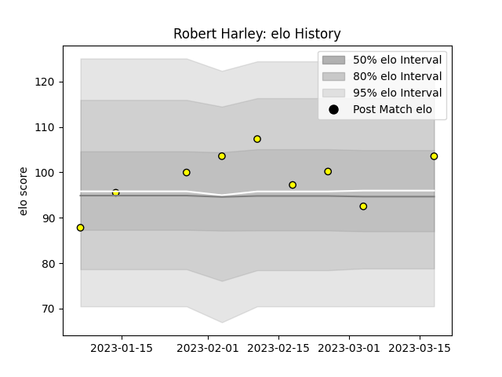

---  
layout: page  
title: Robert Harley  
date: 2023-02-24 02:26:02.079126  
categories: player  
---
# Robert Harley

## Positions: FL, L

## Current elo: 86.0

## Current Percentile: 46.0

# Elo History

# Match History

| Team        |   Appearances |   Win Rate |
|:------------|--------------:|-----------:|
| Carcassonne |             9 |   0.277778 |

| Opponent         |   Matches |   Win Rate |
|:-----------------|----------:|-----------:|
| Aurillac         |         1 |        0   |
| Colomiers        |         1 |        0   |
| Grenoble         |         1 |        0.5 |
| Massy            |         1 |        0   |
| Mont-de-Marsan   |         1 |        0   |
| Nevers           |         1 |        1   |
| Provence Rugby   |         1 |        0   |
| Rouen            |         1 |        1   |
| Soyaux-Angouleme |         1 |        0   |