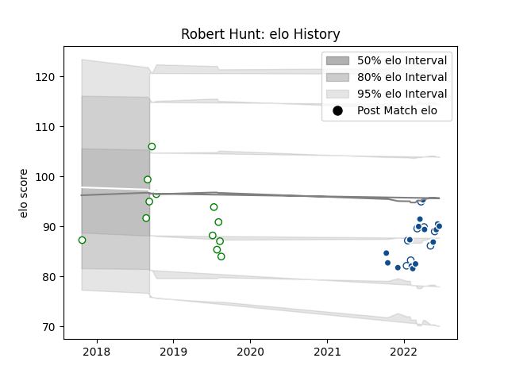

---  
layout: page  
title: Robert Hunt  
date: 2023-03-27 11:37:40.301724  
categories: player  
---
# Robert Hunt

Last updated: 2023-03-27
## Positions: P

## Current elo: 95.0

## Current Percentile: 59.0

# Elo History

# Match History

| Team       |   Appearances |   Win Rate |
|:-----------|--------------:|-----------:|
| Bulls      |            15 |   0.666667 |
| Leopards   |            12 |   0.583333 |
| Blue Bulls |             8 |   0.875    |

| Opponent               |   Matches |   Win Rate |
|:-----------------------|----------:|-----------:|
| Sharks                 |         3 |   0.333333 |
| Boland Cavaliers       |         2 |   1        |
| Griquas                |         2 |   1        |
| Western Province       |         2 |   1        |
| Stormers               |         2 |   0        |
| SWD Eagles             |         2 |   0.5      |
| Pumas                  |         2 |   1        |
| Border Bulldogs        |         2 |   1        |
| Lions                  |         2 |   1        |
| Griffons               |         2 |   0        |
| Eastern Province Kings |         2 |   1        |
| Jaguares XV            |         1 |   0        |
| Leinster               |         1 |   1        |
| Munster                |         1 |   1        |
| Ospreys                |         1 |   1        |
| Golden Lions           |         1 |   1        |
| Free State Cheetahs    |         1 |   0        |
| Scarlets               |         1 |   1        |
| Edinburgh              |         1 |   0        |
| Ulster                 |         1 |   1        |
| Valke                  |         1 |   0        |
| Cardiff Blues          |         1 |   1        |
| Zebre                  |         1 |   1        |