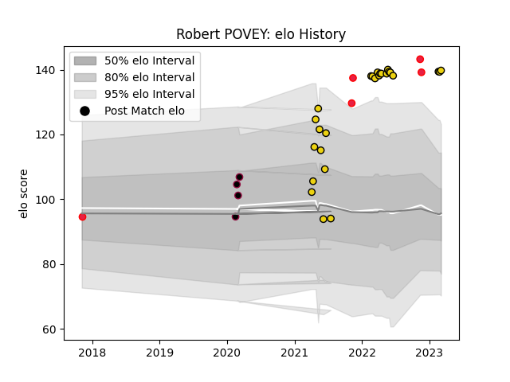

---  
layout: page  
title: Robert POVEY  
date: 2023-03-11 00:12:38.648541  
categories: player  
---
# Robert POVEY

## Positions: FB, FH

## Country: Canada

## Current elo: 140.0

## Current Percentile: 99.0

# Elo History

# Match History

| Team              |   Appearances |   Win Rate |
|:------------------|--------------:|-----------:|
| Houston SaberCats |            26 |   0.384615 |
| Canada            |             5 |   0.4      |
| Utah Warriors     |             4 |   0.625    |

| Opponent               |   Matches |   Win Rate |
|:-----------------------|----------:|-----------:|
| Seattle Seawolves      |         5 |   0.4      |
| Austin Gilgronis       |         4 |   0        |
| L. A. Giltinis         |         3 |   0        |
| San Diego Legion       |         3 |   0.666667 |
| Utah Warriors          |         3 |   0.666667 |
| Dallas Jackals         |         3 |   1        |
| NOLA Gold              |         2 |   0.5      |
| Old Glory DC           |         2 |   0.5      |
| Namibia                |         1 |   0        |
| Netherlands            |         1 |   1        |
| Austin Herd            |         1 |   0.5      |
| New Zealand Maori      |         1 |   0        |
| Portugal               |         1 |   0        |
| Rugby ATL              |         1 |   0        |
| Colorado Raptors       |         1 |   0        |
| Belgium                |         1 |   1        |
| Toronto Arrows         |         1 |   0        |
| New England Free Jacks |         1 |   1        |