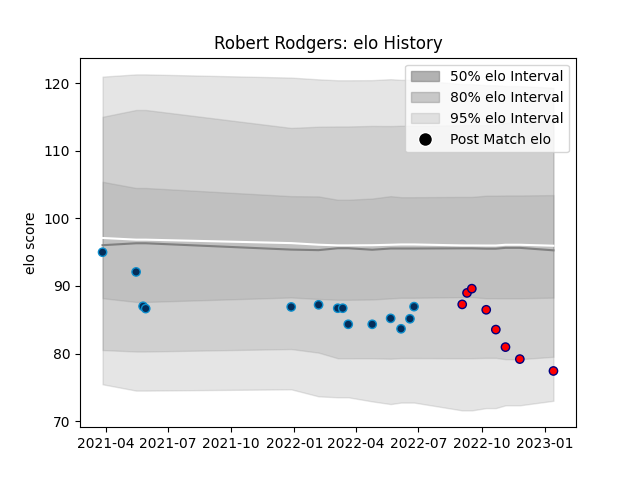

---  
layout: page  
title: Robert Rodgers  
date: 2023-03-17 17:12:55.207830  
categories: player  
---
# Robert Rodgers

## Positions: P

## Current elo: 79.0

## Current Percentile: 12.0

# Elo History

# Match History

| Team                |   Appearances |   Win Rate |
|:--------------------|--------------:|-----------:|
| Montpellier Herault |            14 |   0.571429 |
| Aurillac            |             7 |   0.428571 |

| Opponent             |   Matches |   Win Rate |
|:---------------------|----------:|-----------:|
| Bordeaux Begles      |         3 |   0.333333 |
| Biarritz Olympique   |         2 |   0.5      |
| Castres Olympique    |         2 |   0.5      |
| Stade Toulousain     |         2 |   0.5      |
| Agen                 |         1 |   0        |
| Bayonne              |         1 |   1        |
| Carcassonne          |         1 |   0        |
| Clermont Auvergne    |         1 |   0        |
| Massy                |         1 |   1        |
| Oyonnax              |         1 |   0        |
| Pau                  |         1 |   1        |
| Provence Rugby       |         1 |   1        |
| Racing 92            |         1 |   1        |
| Soyaux-Angouleme     |         1 |   1        |
| Stade Francais Paris |         1 |   0        |
| Toulon               |         1 |   1        |