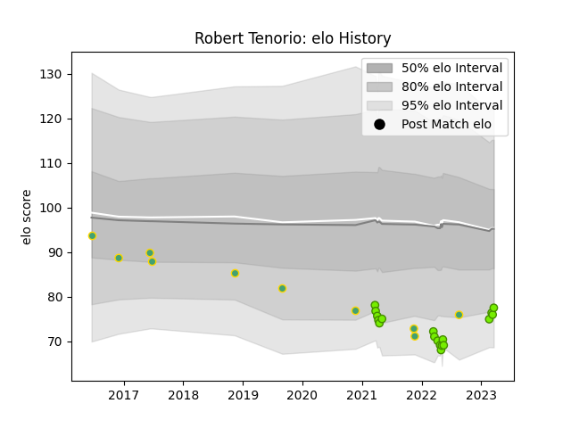

---  
layout: page  
title: Robert Tenorio  
date: 2023-03-21 18:30:44.163811  
categories: player  
---
# Robert Tenorio

Last updated: 2023-03-21
## Positions: W, C

## Country: Brazil

## Current elo: 77.0

## Current Percentile: 8.0

# Elo History

# Match History

| Team   |   Appearances |   Win Rate |
|:-------|--------------:|-----------:|
| Cobras |            18 |   0.166667 |
| Brazil |            10 |   0.1      |

| Opponent          |   Matches |   Win Rate |
|:------------------|----------:|-----------:|
| Penarol Rugby     |         5 |   0        |
| Selknam           |         5 |   0.4      |
| Jaguares XV       |         3 |   0        |
| Portugal          |         3 |   0.333333 |
| Kenya             |         2 |   0        |
| Olimpia Lions     |         2 |   0.5      |
| Cafeteros Pro     |         1 |   0        |
| Chile             |         1 |   0        |
| New Zealand Maori |         1 |   0        |
| Pampas XV         |         1 |   0        |
| Romania           |         1 |   0        |
| Uruguay           |         1 |   0        |
| Yacare XV         |         1 |   0        |
| Zimbabwe          |         1 |   0        |