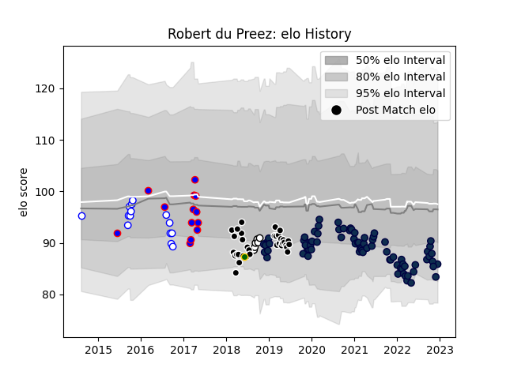

---  
layout: page  
title: Robert du Preez  
date: 2022-12-14 11:26:12.434904  
categories: player  
---
# Robert du Preez

## Positions: FH, C

## Country: South Africa

## Current elo: 86.0

## Current Percentile: 11.0

# Elo History

# Match History

| Team             |   Appearances |   Win Rate |
|:-----------------|--------------:|-----------:|
| Sale Sharks      |            77 |   0.642857 |
| Sharks           |            34 |   0.441176 |
| Western Province |            14 |   0.714286 |
| Stormers         |            13 |   0.538462 |
| Natal Sharks     |             6 |   0.833333 |
| South Africa     |             1 |   0        |

| Opponent                 |   Matches |   Win Rate |
|:-------------------------|----------:|-----------:|
| Exeter Chiefs            |         9 |   0.333333 |
| Northampton Saints       |         8 |   0.875    |
| Saracens                 |         7 |   0.285714 |
| Bristol Rugby            |         7 |   0.714286 |
| Gloucester Rugby         |         7 |   0.857143 |
| Bath Rugby               |         6 |   0.5      |
| London Irish             |         6 |   0.916667 |
| Harlequins               |         6 |   0.5      |
| Wasps                    |         5 |   0.8      |
| Lions                    |         5 |   0.6      |
| Jaguares                 |         5 |   0.4      |
| Bulls                    |         5 |   0.2      |
| Worcester Warriors       |         4 |   0.5      |
| Chiefs                   |         4 |   0.5      |
| Golden Lions             |         4 |   0.25     |
| Stormers                 |         4 |   0.5      |
| Blue Bulls               |         4 |   0.75     |
| Leicester Tigers         |         4 |   1        |
| Crusaders                |         3 |   0.166667 |
| Sunwolves                |         3 |   1        |
| Pumas                    |         3 |   1        |
| Hurricanes               |         3 |   0        |
| Newcastle Falcons        |         3 |   0.666667 |
| Blues                    |         2 |   1        |
| Bordeaux Begles          |         2 |   0.5      |
| New South Wales Waratahs |         2 |   0.75     |
| Eastern Province Kings   |         2 |   1        |
| Melbourne Rebels         |         2 |   0.5      |
| Brumbies                 |         2 |   0        |
| Highlanders              |         2 |   0.5      |
| Cheetahs                 |         2 |   1        |
| Griquas                  |         2 |   1        |
| Natal Sharks             |         2 |   1        |
| La Rochelle              |         1 |   1        |
| Queensland Reds          |         1 |   0        |
| Boland Cavaliers         |         1 |   1        |
| Sharks                   |         1 |   0        |
| Southern Kings           |         1 |   1        |
| Glasgow Warriors         |         1 |   0        |
| Ulster                   |         1 |   1        |
| Wales                    |         1 |   0        |
| Free State Cheetahs      |         1 |   1        |
| Western Province         |         1 |   0        |