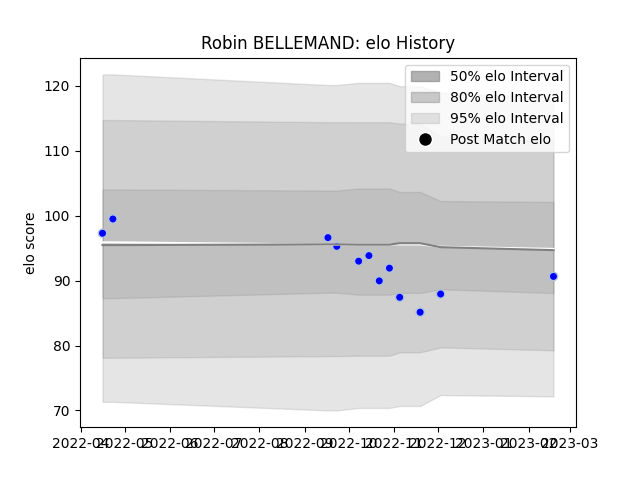

---  
layout: page  
title: Robin BELLEMAND  
date: 2023-03-11 00:16:48.551449  
categories: player  
---
# Robin BELLEMAND

## Positions: P

## Current elo: 83.0

## Current Percentile: 18.0

# Elo History

# Match History

| Team      |   Appearances |   Win Rate |
|:----------|--------------:|-----------:|
| Colomiers |            13 |   0.461538 |

| Opponent           |   Matches |   Win Rate |
|:-------------------|----------:|-----------:|
| Mont-de-Marsan     |         2 |        0.5 |
| Vannes             |         2 |        0.5 |
| Agen               |         1 |        1   |
| Aurillac           |         1 |        0   |
| Beziers            |         1 |        1   |
| Biarritz Olympique |         1 |        0   |
| Grenoble           |         1 |        0   |
| Montauban          |         1 |        0   |
| Nevers             |         1 |        1   |
| Oyonnax            |         1 |        0   |
| Soyaux-Angouleme   |         1 |        1   |