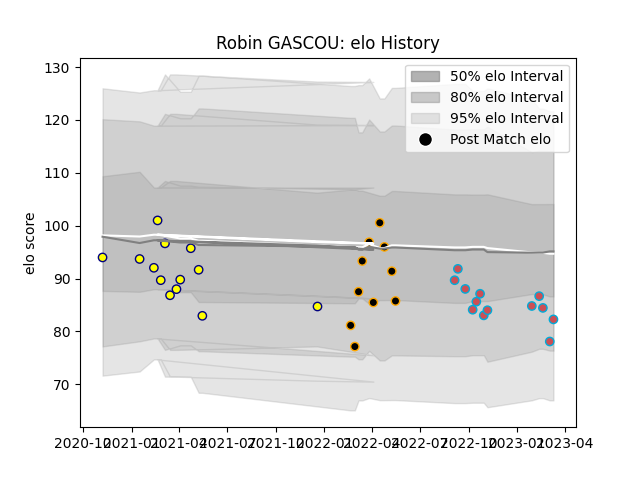

---  
layout: page  
title: Robin GASCOU  
date: 2023-02-02 19:01:24.052889  
categories: player  
---
# Robin GASCOU

## Positions: L, N8

## Current elo: 82.0

## Current Percentile: 15.0

# Elo History

# Match History

| Team             |   Appearances |   Win Rate |
|:-----------------|--------------:|-----------:|
| Nevers           |            13 |   0.269231 |
| Bourgoin-Jallieu |             9 |   0.388889 |
| Chambery         |             9 |   0.444444 |

| Opponent                   |   Matches |   Win Rate |
|:---------------------------|----------:|-----------:|
| Albi                       |         2 |       0    |
| Valence Romans Drome Rugby |         2 |       0.25 |
| Tarbes                     |         2 |       0    |
| Carcassonne                |         2 |       0    |
| Dax                        |         2 |       0.5  |
| Montauban                  |         2 |       0.5  |
| Narbonne                   |         1 |       1    |
| US Bressane                |         1 |       0    |
| Suresnes                   |         1 |       0    |
| Soyaux-Angouleme           |         1 |       1    |
| Rouen                      |         1 |       0    |
| Provence Rugby             |         1 |       1    |
| Perpignan                  |         1 |       0    |
| Nice                       |         1 |       1    |
| Massy                      |         1 |       0    |
| Beziers                    |         1 |       1    |
| Grenoble                   |         1 |       0    |
| Dijon                      |         1 |       1    |
| Colomiers                  |         1 |       0    |
| Cognac Saint Jean d'Angély |         1 |       0    |
| Carqueiranne-Hyères        |         1 |       1    |
| Bourgoin-Jallieu           |         1 |       1    |
| Blagnac                    |         1 |       0    |
| Biarritz Olympique         |         1 |       0    |
| Vannes                     |         1 |       0.5  |