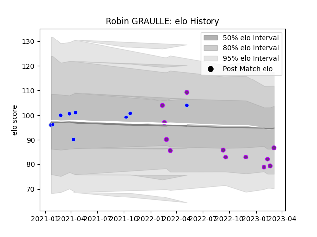

---  
layout: page  
title: Robin GRAULLE  
date: 2023-02-24 14:47:31.379902  
categories: player  
---
# Robin GRAULLE

## Positions: SH, W

## Current elo: 82.0

## Current Percentile: 19.0

# Elo History

# Match History

| Team        |   Appearances |   Win Rate |
|:------------|--------------:|-----------:|
| US Bressane |            11 |   0.454545 |
| Colomiers   |             9 |   0.333333 |

| Opponent                   |   Matches |   Win Rate |
|:---------------------------|----------:|-----------:|
| Vannes                     |         2 |        0   |
| Nevers                     |         2 |        0.5 |
| Albi                       |         1 |        0   |
| US Bressane                |         1 |        0   |
| Rennes                     |         1 |        1   |
| Perpignan                  |         1 |        0   |
| Oyonnax                    |         1 |        1   |
| Montauban                  |         1 |        1   |
| Mont-de-Marsan             |         1 |        0   |
| Agen                       |         1 |        1   |
| Cognac Saint Jean d'Angély |         1 |        1   |
| Chambery                   |         1 |        1   |
| Carqueiranne-Hyères        |         1 |        0   |
| Carcassonne                |         1 |        0   |
| Blagnac                    |         1 |        0   |
| Biarritz Olympique         |         1 |        0   |
| Beziers                    |         1 |        0   |
| Colomiers                  |         1 |        1   |