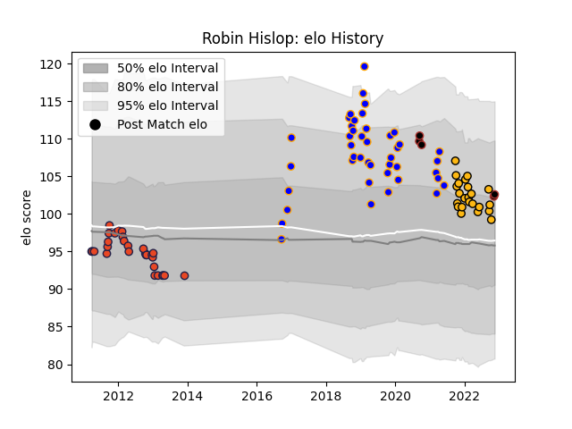

---  
layout: page  
title: Robin Hislop  
date: 2023-01-23 15:32:39.276529  
categories: player  
---
# Robin Hislop

## Positions: P

## Current elo: 84.0

## Current Percentile: 73.0

# Elo History

# Match History

| Team      |   Appearances |   Win Rate |
|:----------|--------------:|-----------:|
| Doncaster |            53 |   0.528302 |
| Edinburgh |            29 |   0.172414 |
| Wasps     |            23 |   0.391304 |
| Saracens  |             7 |   0.5      |

| Opponent            |   Matches |   Win Rate |
|:--------------------|----------:|-----------:|
| Jersey              |         6 |   0.333333 |
| Nottingham          |         5 |   0.6      |
| Cornish Pirates     |         5 |   0.2      |
| Coventry            |         5 |   0.6      |
| Ealing Trailfinders |         5 |   0        |
| Hartpury College    |         4 |   1        |
| Saracens            |         4 |   0.25     |
| Richmond            |         4 |   1        |
| Ospreys             |         4 |   0.25     |
| Northampton Saints  |         4 |   0.5      |
| Munster             |         4 |   0.25     |
| London Scottish     |         4 |   1        |
| London Irish        |         4 |   0        |
| Yorkshire Carnegie  |         4 |   0.25     |
| Bath Rugby          |         4 |   0.875    |
| Bedford             |         4 |   0.75     |
| Glasgow Warriors    |         3 |   0        |
| Bristol Rugby       |         3 |   0.666667 |
| Exeter Chiefs       |         3 |   0.666667 |
| Sale Sharks         |         3 |   0        |
| Leinster            |         3 |   0        |
| Dragons             |         3 |   0.666667 |
| Connacht            |         3 |   0.333333 |
| Ulster              |         2 |   0        |
| Rotherham Titans    |         2 |   1        |
| Cardiff Blues       |         2 |   0        |
| Gloucester Rugby    |         2 |   0        |
| Newcastle Falcons   |         2 |   0.5      |
| Leicester Tigers    |         2 |   0.5      |
| Ampthill            |         2 |   0.5      |
| Harlequins          |         2 |   0        |
| Benetton Treviso    |         1 |   0        |
| Edinburgh           |         1 |   0        |
| Scarlets            |         1 |   0        |
| Worcester Warriors  |         1 |   0        |
| Aironi              |         1 |   0        |