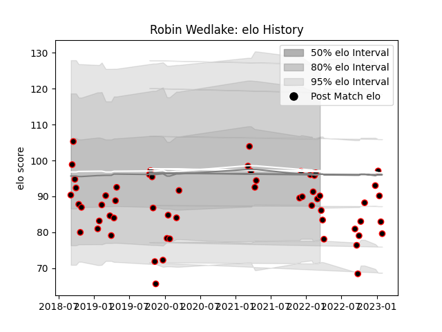

---  
layout: page  
title: Robin Wedlake  
date: 2023-02-02 18:47:12.569954  
categories: player  
---
# Robin Wedlake

## Positions: W

## Current elo: 90.0

## Current Percentile: 38.0

# Elo History

# Match History

| Team            |   Appearances |   Win Rate |
|:----------------|--------------:|-----------:|
| Cornish Pirates |            58 |   0.637931 |

| Opponent            |   Matches |   Win Rate |
|:--------------------|----------:|-----------:|
| Bedford             |         7 |   0.428571 |
| Nottingham          |         7 |   0.857143 |
| Doncaster           |         6 |   0.833333 |
| Jersey              |         6 |   0.333333 |
| Ampthill            |         5 |   0.9      |
| Hartpury College    |         5 |   0.8      |
| Richmond            |         5 |   0.9      |
| Ealing Trailfinders |         4 |   0.25     |
| London Scottish     |         4 |   0.5      |
| Coventry            |         3 |   0.666667 |
| London Irish        |         2 |   0        |
| Yorkshire Carnegie  |         2 |   1        |
| Newcastle Falcons   |         1 |   0        |
| Saracens            |         1 |   1        |