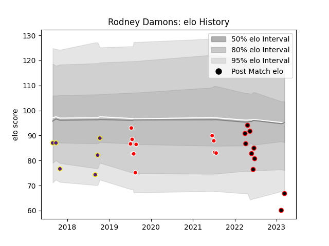

---  
layout: page  
title: Rodney Damons  
date: 2023-03-12 11:31:58.957899  
categories: player  
---
# Rodney Damons

## Positions: W

## Current elo: 67.0

## Current Percentile: 2.0

# Elo History

# Match History

| Team                   |   Appearances |   Win Rate |
|:-----------------------|--------------:|-----------:|
| Valke                  |            11 |   0.545455 |
| Eastern Province Kings |            10 |   0.6      |
| Griffons               |             6 |   0.5      |

| Opponent               |   Matches |   Win Rate |
|:-----------------------|----------:|-----------:|
| SWD Eagles             |         6 |   0.75     |
| Griffons               |         4 |   0.125    |
| Border Bulldogs        |         3 |   0.666667 |
| Eastern Province Kings |         3 |   0.666667 |
| Leopards               |         3 |   1        |
| Boland Cavaliers       |         2 |   1        |
| Black Lion             |         1 |   0        |
| Griquas                |         1 |   0        |
| Jaguares XV            |         1 |   0        |
| Namibia Welwitchias    |         1 |   1        |
| Tusker Simba           |         1 |   0        |
| Valke                  |         1 |   0        |