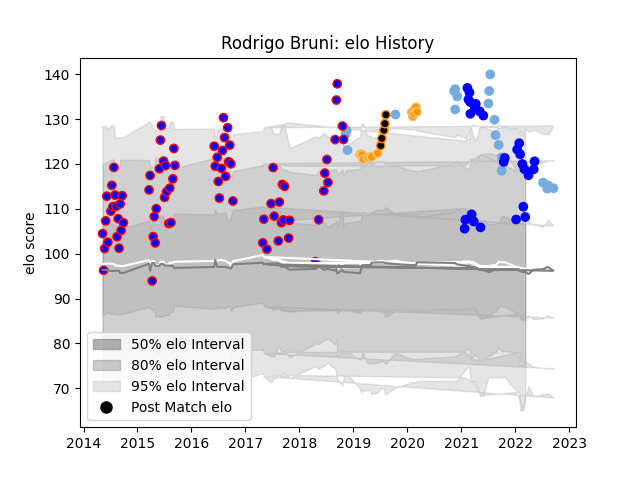

---  
layout: page  
title: Rodrigo Bruni  
date: 2023-03-27 11:36:54.571004  
categories: player  
---
# Rodrigo Bruni

Last updated: 2023-03-27
## Positions: N8, FL

## Country: Argentina

## Current elo: 108.0

## Current Percentile: 88.0

# Elo History

# Match History

| Team        |   Appearances |   Win Rate |
|:------------|--------------:|-----------:|
| San Luis    |            79 |   0.601266 |
| Vannes      |            27 |   0.666667 |
| Argentina   |            20 |   0.35     |
| Jaguares    |            15 |   0.666667 |
| Jaguares XV |             5 |   1        |

| Opponent                   |   Matches |   Win Rate |
|:---------------------------|----------:|-----------:|
| Belgrano                   |         8 |   0.125    |
| Australia                  |         7 |   0.357143 |
| SIC                        |         7 |   0.571429 |
| Alumni                     |         7 |   0.642857 |
| Atlético del Rosario       |         6 |   0.666667 |
| Regatas Bella Vista        |         6 |   1        |
| CUBA                       |         5 |   0.3      |
| Hindu                      |         5 |   0.4      |
| Newman                     |         5 |   0.4      |
| Pucara                     |         5 |   0.4      |
| CASI                       |         5 |   0.6      |
| La Plata                   |         4 |   0.5      |
| Pueyrredón                 |         3 |   1        |
| Lions                      |         3 |   0.333333 |
| Mont-de-Marsan             |         3 |   1        |
| Lomas                      |         3 |   1        |
| Carcassonne                |         3 |   0.5      |
| Bulls                      |         3 |   1        |
| South Africa               |         3 |   0        |
| Olivos                     |         2 |   0.75     |
| San Martin                 |         2 |   1        |
| New Zealand                |         2 |   0.5      |
| Scotland                   |         2 |   0        |
| Nevers                     |         2 |   0.75     |
| Montauban                  |         2 |   1        |
| Sharks                     |         2 |   0.5      |
| Stormers                   |         2 |   0.5      |
| Agen                       |         2 |   0.5      |
| Mariano Moreno             |         2 |   1        |
| Wales                      |         2 |   0.75     |
| Grenoble                   |         2 |   0.5      |
| Aurillac                   |         2 |   1        |
| Beziers                    |         2 |   0.5      |
| Rouen                      |         1 |   0        |
| Valke                      |         1 |   1        |
| Valence Romans Drome Rugby |         1 |   0        |
| United States of America   |         1 |   1        |
| US Bressane                |         1 |   1        |
| Sunwolves                  |         1 |   1        |
| Soyaux-Angouleme           |         1 |   1        |
| Biarritz Olympique         |         1 |   0        |
| Blues                      |         1 |   1        |
| Boland Cavaliers           |         1 |   1        |
| SWD Eagles                 |         1 |   1        |
| Brumbies                   |         1 |   1        |
| Manuel Belgrano            |         1 |   1        |
| Los Tilos                  |         1 |   1        |
| Buenos Aires               |         1 |   1        |
| Queensland Reds            |         1 |   1        |
| Colomiers                  |         1 |   1        |
| Eastern Province Kings     |         1 |   1        |
| Provence Rugby             |         1 |   1        |
| Oyonnax                    |         1 |   0        |
| France                     |         1 |   0        |
| Griffons                   |         1 |   1        |
| Hurricanes                 |         1 |   0        |
| Narbonne                   |         1 |   1        |
| Ireland                    |         1 |   0        |
| Liceo Naval                |         1 |   1        |
| Romania                    |         1 |   1        |