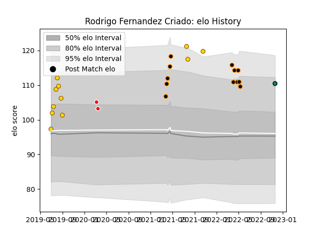

---  
layout: page  
title: Rodrigo Fernandez Criado  
date: 2022-12-09 13:16:20.810805  
categories: player  
---
# Rodrigo Fernandez Criado

## Positions: L

## Current elo: 109.0

## Current Percentile: 87.0

# Elo History

# Match History

| Team         |   Appearances |   Win Rate |
|:-------------|--------------:|-----------:|
| Jaguares XV  |            12 |   0.666667 |
| Belgrano     |            11 |   0.772727 |
| Ceibos Rugby |             2 |   1        |
| Montauban    |             2 |   0.5      |

| Opponent            |   Matches |   Win Rate |
|:--------------------|----------:|-----------:|
| Selknam             |         5 |   0.6      |
| Olimpia Lions       |         3 |   1        |
| Penarol Rugby       |         3 |   0.333333 |
| Cafeteros Pro       |         2 |   1        |
| Regatas Bella Vista |         2 |   1        |
| SIC                 |         2 |   0.5      |
| Alumni              |         1 |   0        |
| Buenos Aires        |         1 |   1        |
| Cobras              |         1 |   1        |
| Colomiers           |         1 |   1        |
| Hindu               |         1 |   1        |
| La Plata            |         1 |   1        |
| Newman              |         1 |   1        |
| Pucara              |         1 |   1        |
| Rouen               |         1 |   0        |
| San Luis            |         1 |   0.5      |