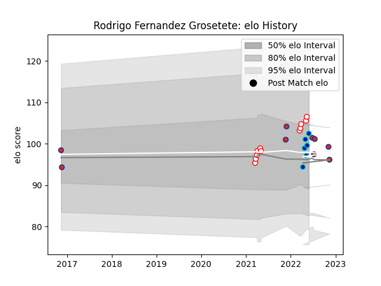

---  
layout: page  
title: Rodrigo Fernandez Grosetete  
date: 2022-11-15 23:36:22.427245  
categories: player  
---
# Rodrigo Fernandez Grosetete

## Positions: FB, FH

## Country: Chile

## Current elo: 102.0

## Current Percentile: 79.0

# Elo History

# Match History

| Team        |   Appearances |   Win Rate |
|:------------|--------------:|-----------:|
| Selknam     |            11 |   0.727273 |
| Chile       |             9 |   0.444444 |
| Fijian Drua |             6 |   0.166667 |

| Opponent                 |   Matches |   Win Rate |
|:-------------------------|----------:|-----------:|
| Cobras                   |         3 |   0.666667 |
| Korea                    |         2 |   0.5      |
| Jaguares XV              |         2 |   1        |
| Russia                   |         2 |   1        |
| Penarol Rugby            |         2 |   0.5      |
| Olimpia Lions            |         2 |   0.5      |
| United States of America |         2 |   0.5      |
| Cafeteros Pro            |         2 |   1        |
| Hurricanes               |         1 |   0        |
| Brumbies                 |         1 |   0        |
| Moana Pasifika           |         1 |   1        |
| Highlanders              |         1 |   0        |
| Chiefs                   |         1 |   0        |
| Romania                  |         1 |   0        |
| Scotland                 |         1 |   0        |
| Tonga                    |         1 |   0        |
| Blues                    |         1 |   0        |