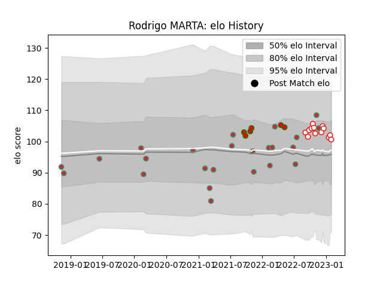

---  
layout: page  
title: Rodrigo MARTA  
date: 2023-02-17 14:39:15.621985  
categories: player  
---
# Rodrigo MARTA

## Positions: W, C

## Country: Portugal

## Current elo: 110.0

## Current Percentile: 70.0

# Elo History

# Match History

| Team         |   Appearances |   Win Rate |
|:-------------|--------------:|-----------:|
| Portugal     |            26 |   0.461538 |
| Dax          |            13 |   0.846154 |
| Lusitanos XV |             6 |   0.833333 |

| Opponent                   |   Matches |   Win Rate |
|:---------------------------|----------:|-----------:|
| Romania                    |         4 |   0.25     |
| Georgia                    |         4 |   0.125    |
| Spain                      |         3 |   0.333333 |
| Russia                     |         2 |   0.5      |
| US Bressane                |         2 |   1        |
| Netherlands                |         2 |   1        |
| Bourgoin-Jallieu           |         2 |   0.5      |
| Castilla y Leon Iberians   |         2 |   1        |
| Chambery                   |         2 |   1        |
| Nice                       |         1 |   1        |
| Poland                     |         1 |   1        |
| Albi                       |         1 |   0        |
| Namibia                    |         1 |   0        |
| Suresnes                   |         1 |   1        |
| Tarbes                     |         1 |   1        |
| Tel-Aviv Heat              |         1 |   1        |
| Narbonne                   |         1 |   1        |
| Hong Kong                  |         1 |   1        |
| Japan                      |         1 |   0        |
| Italy                      |         1 |   0        |
| Argentina                  |         1 |   0        |
| Germany                    |         1 |   1        |
| Delta                      |         1 |   1        |
| Cognac Saint Jean d'Angély |         1 |   1        |
| Canada                     |         1 |   1        |
| Brussels Devils            |         1 |   1        |
| Brazil                     |         1 |   1        |
| Blagnac                    |         1 |   1        |
| Black Lion                 |         1 |   0        |
| Belgium                    |         1 |   1        |
| United States of America   |         1 |   0.5      |