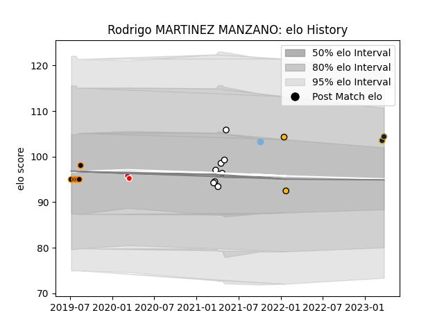

---  
layout: page  
title: Rodrigo MARTINEZ MANZANO  
date: 2023-03-30 11:31:59.287313  
categories: player  
---
# Rodrigo MARTINEZ MANZANO

Last updated: 2023-03-30
## Positions: P

## Country: Argentina

## Current elo: 105.0

## Current Percentile: 79.0

# Elo History

# Match History

| Team          |   Appearances |   Win Rate |
|:--------------|--------------:|-----------:|
| Olimpia Lions |             8 |   0.625    |
| Jaguares XV   |             6 |   1        |
| Pampas XV     |             3 |   0.666667 |
| Ceibos Rugby  |             2 |   1        |
| Wasps         |             2 |   0.5      |
| Argentina     |             1 |   0        |

| Opponent               |   Matches |   Win Rate |
|:-----------------------|----------:|-----------:|
| Selknam                |         3 |   0.666667 |
| Cafeteros Pro          |         2 |   1        |
| Cobras                 |         2 |   1        |
| Penarol Rugby          |         2 |   0.5      |
| Australia              |         1 |   0        |
| Olimpia Lions          |         1 |   1        |
| Valke                  |         1 |   1        |
| Stade Toulousain       |         1 |   1        |
| SWD Eagles             |         1 |   1        |
| Leopards               |         1 |   1        |
| Munster                |         1 |   0        |
| Border Bulldogs        |         1 |   1        |
| Jaguares XV            |         1 |   0        |
| Griffons               |         1 |   1        |
| Eastern Province Kings |         1 |   1        |
| Dogos XV               |         1 |   0        |
| Yacare XV              |         1 |   1        |