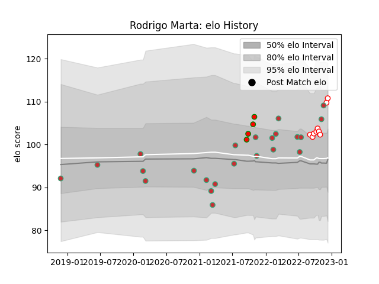

---  
layout: page  
title: Rodrigo Marta  
date: 2022-12-09 13:17:27.674852  
categories: player  
---
# Rodrigo Marta

## Positions: W, C

## Country: Portugal

## Current elo: 110.0

## Current Percentile: 85.0

# Elo History

# Match History

| Team         |   Appearances |   Win Rate |
|:-------------|--------------:|-----------:|
| Portugal     |            23 |   0.434783 |
| Dax          |             8 |   0.75     |
| Lusitanos XV |             4 |   1        |

| Opponent                   |   Matches |   Win Rate |
|:---------------------------|----------:|-----------:|
| Georgia                    |         4 |   0.125    |
| Spain                      |         3 |   0.333333 |
| Romania                    |         3 |   0.333333 |
| Russia                     |         2 |   0.5      |
| Castilla y Leon Iberians   |         2 |   1        |
| Netherlands                |         2 |   1        |
| Albi                       |         1 |   0        |
| Italy                      |         1 |   0        |
| US Bressane                |         1 |   1        |
| Tarbes                     |         1 |   1        |
| Suresnes                   |         1 |   1        |
| Namibia                    |         1 |   0        |
| Japan                      |         1 |   0        |
| Germany                    |         1 |   1        |
| Hong Kong                  |         1 |   1        |
| Argentina                  |         1 |   0        |
| Delta                      |         1 |   1        |
| Cognac Saint Jean d'Angély |         1 |   1        |
| Chambery                   |         1 |   1        |
| Canada                     |         1 |   1        |
| Brussels Devils            |         1 |   1        |
| Brazil                     |         1 |   1        |
| Bourgoin-Jallieu           |         1 |   0        |
| Blagnac                    |         1 |   1        |
| United States of America   |         1 |   0.5      |