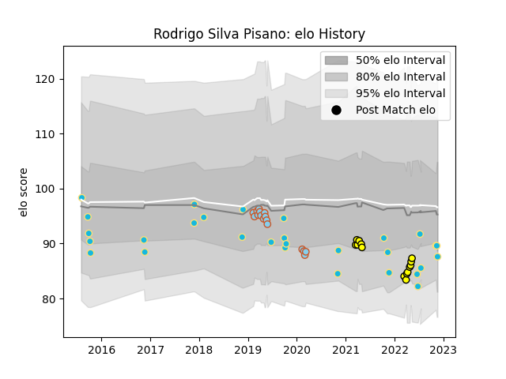

---  
layout: page  
title: Rodrigo Silva Pisano  
date: 2022-11-22 11:31:49.455044  
categories: player  
---
# Rodrigo Silva Pisano

## Positions: FB, W

## Country: Uruguay

## Current elo: 88.0

## Current Percentile: 13.0

# Elo History

# Match History

| Team               |   Appearances |   Win Rate |
|:-------------------|--------------:|-----------:|
| Uruguay            |            29 |   0.344828 |
| Penarol Rugby      |            14 |   0.785714 |
| Austin Elite Rugby |            12 |   0        |
| Austin Herd        |             4 |   0.375    |

| Opponent                 |   Matches |   Win Rate |
|:-------------------------|----------:|-----------:|
| Romania                  |         5 |   0.6      |
| Spain                    |         4 |   0.25     |
| Olimpia Lions            |         4 |   0.75     |
| Toronto Arrows           |         3 |   0        |
| Selknam                  |         3 |   0.666667 |
| Fiji                     |         3 |   0.333333 |
| Jaguares XV              |         3 |   0.666667 |
| NOLA Gold                |         2 |   0        |
| Japan                    |         2 |   0        |
| Utah Warriors            |         2 |   0.25     |
| R.U. New York            |         2 |   0        |
| Namibia                  |         2 |   1        |
| Australia                |         2 |   0        |
| Wales                    |         2 |   0        |
| Houston SaberCats        |         2 |   0.5      |
| Glendale Raptors         |         2 |   0        |
| Georgia                  |         2 |   0        |
| Cobras                   |         2 |   1        |
| Cafeteros Pro            |         2 |   1        |
| Italy                    |         1 |   0        |
| Old Glory DC             |         1 |   0        |
| Germany                  |         1 |   0        |
| San Diego Legion         |         1 |   0        |
| Seattle Seawolves        |         1 |   0        |
| England                  |         1 |   0        |
| Tonga                    |         1 |   0        |
| Canada                   |         1 |   1        |
| United States of America |         1 |   1        |
| Argentina                |         1 |   1        |