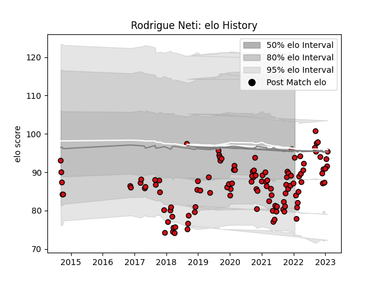

---  
layout: page  
title: Rodrigue Neti  
date: 2023-01-06 00:18:47.079867  
categories: player  
---
# Rodrigue Neti

## Positions: P

## Current elo: 102.0

## Current Percentile: 22.0

# Elo History

# Match History

| Team             |   Appearances |   Win Rate |
|:-----------------|--------------:|-----------:|
| Stade Toulousain |           111 |   0.603604 |

| Opponent             |   Matches |   Win Rate |
|:---------------------|----------:|-----------:|
| Lyon                 |        11 |   0.318182 |
| Pau                  |         9 |   0.777778 |
| Stade Francais Paris |         9 |   0.5      |
| Racing 92            |         9 |   0.555556 |
| Bordeaux Begles      |         8 |   0.75     |
| Clermont Auvergne    |         8 |   0.5625   |
| La Rochelle          |         8 |   0.75     |
| Castres Olympique    |         7 |   0.357143 |
| Toulon               |         6 |   0.666667 |
| Brive                |         6 |   0.666667 |
| Bayonne              |         6 |   0.333333 |
| Montpellier Herault  |         6 |   0.833333 |
| Perpignan            |         3 |   0.666667 |
| Sale Sharks          |         2 |   0.75     |
| Agen                 |         2 |   1        |
| Grenoble             |         2 |   1        |
| Cardiff Blues        |         2 |   0.5      |
| Oyonnax              |         1 |   0.5      |
| Munster              |         1 |   1        |
| Exeter Chiefs        |         1 |   0        |
| Connacht             |         1 |   1        |
| Biarritz Olympique   |         1 |   1        |
| Ulster               |         1 |   1        |
| Wasps                |         1 |   0        |