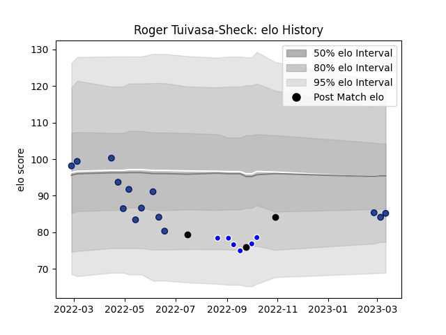

---  
layout: page  
title: Roger Tuivasa-Sheck  
date: 2023-03-21 18:02:37.715573  
categories: player  
---
# Roger Tuivasa-Sheck

Last updated: 2023-03-21
## Positions: C

## Country: New Zealand

## Current elo: 84.0

## Current Percentile: 21.0

# Elo History

# Match History

| Team        |   Appearances |   Win Rate |
|:------------|--------------:|-----------:|
| Blues       |            15 |   0.733333 |
| Auckland    |             6 |   0.5      |
| New Zealand |             3 |   0.666667 |

| Opponent         |   Matches |   Win Rate |
|:-----------------|----------:|-----------:|
| Brumbies         |         3 |   0.666667 |
| Crusaders        |         3 |   0.333333 |
| Highlanders      |         2 |   1        |
| Hurricanes       |         2 |   0.5      |
| Australia        |         1 |   1        |
| North Harbour    |         1 |   1        |
| Waikato          |         1 |   0        |
| Tasman           |         1 |   1        |
| Taranaki         |         1 |   1        |
| Queensland Reds  |         1 |   1        |
| Northland        |         1 |   0        |
| Japan            |         1 |   1        |
| Melbourne Rebels |         1 |   1        |
| Bay of Plenty    |         1 |   0        |
| Ireland          |         1 |   0        |
| Fijian Drua      |         1 |   1        |
| Chiefs           |         1 |   1        |
| Western Force    |         1 |   1        |