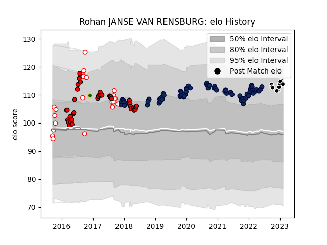

---  
layout: page  
title: Rohan JANSE VAN RENSBURG  
date: 2023-03-04 11:37:03.702939  
categories: player  
---
# Rohan JANSE VAN RENSBURG

## Positions: C

## Country: South Africa

## Current elo: 114.0

## Current Percentile: 85.0

# Elo History

# Match History

| Team         |   Appearances |   Win Rate |
|:-------------|--------------:|-----------:|
| Sale Sharks  |            68 |   0.617647 |
| Lions        |            39 |   0.74359  |
| Golden Lions |            20 |   0.65     |
| Sharks       |             4 |   0.5      |
| South Africa |             1 |   0        |

| Opponent                 |   Matches |   Win Rate |
|:-------------------------|----------:|-----------:|
| Northampton Saints       |         7 |   0.857143 |
| Exeter Chiefs            |         6 |   0.166667 |
| Wasps                    |         6 |   1        |
| Sharks                   |         6 |   1        |
| Bath Rugby               |         5 |   0.5      |
| Worcester Warriors       |         5 |   0.4      |
| Western Province         |         5 |   0.6      |
| Harlequins               |         5 |   1        |
| Leicester Tigers         |         5 |   0.6      |
| Free State Cheetahs      |         5 |   0.4      |
| Hurricanes               |         4 |   0.25     |
| Newcastle Falcons        |         4 |   0.5      |
| Jaguares                 |         3 |   0.666667 |
| Highlanders              |         3 |   0.333333 |
| Gloucester Rugby         |         3 |   0.333333 |
| Saracens                 |         3 |   0        |
| Natal Sharks             |         3 |   0.666667 |
| Crusaders                |         3 |   0.333333 |
| Southern Kings           |         3 |   1        |
| Stormers                 |         3 |   1        |
| London Irish             |         3 |   0.833333 |
| Cardiff Blues            |         3 |   0.333333 |
| Bristol Rugby            |         3 |   0.666667 |
| Blue Bulls               |         3 |   0.666667 |
| Ospreys                  |         2 |   1        |
| Queensland Reds          |         2 |   0.5      |
| Sunwolves                |         2 |   1        |
| New South Wales Waratahs |         2 |   1        |
| La Rochelle              |         2 |   0.5      |
| Connacht                 |         2 |   1        |
| Griquas                  |         2 |   1        |
| Blues                    |         2 |   0.5      |
| Bulls                    |         2 |   1        |
| Cheetahs                 |         2 |   1        |
| Clermont Auvergne        |         1 |   0        |
| Brumbies                 |         1 |   1        |
| Wales                    |         1 |   0        |
| Chiefs                   |         1 |   1        |
| Lyon                     |         1 |   1        |
| Leinster                 |         1 |   0        |
| Scarlets                 |         1 |   1        |
| Dragons                  |         1 |   1        |
| Eastern Province Kings   |         1 |   1        |
| Pumas                    |         1 |   1        |
| Perpignan                |         1 |   1        |
| Edinburgh                |         1 |   0        |
| Zebre                    |         1 |   1        |