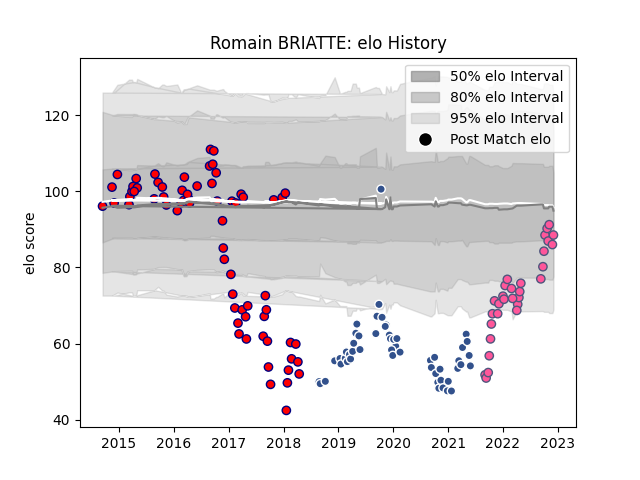

---  
layout: page  
title: Romain BRIATTE  
date: 2023-02-05 15:15:43.808276  
categories: player  
---
# Romain BRIATTE

## Positions: FL

## Current elo: 108.0

## Current Percentile: 87.0

# Elo History

# Match History

| Team                 |   Appearances |   Win Rate |
|:---------------------|--------------:|-----------:|
| Aurillac             |            68 |   0.463235 |
| Agen                 |            52 |   0.182692 |
| Stade Francais Paris |            34 |   0.455882 |

| Opponent             |   Matches |   Win Rate |
|:---------------------|----------:|-----------:|
| Perpignan            |        11 |   0.681818 |
| Racing 92            |         9 |   0.166667 |
| Castres Olympique    |         8 |   0.25     |
| Bayonne              |         7 |   0.285714 |
| Montauban            |         7 |   0.5      |
| Bordeaux Begles      |         7 |   0        |
| Pau                  |         7 |   0.428571 |
| Colomiers            |         7 |   0.285714 |
| Dax                  |         6 |   0.5      |
| Lyon                 |         6 |   0.333333 |
| Stade Toulousain     |         6 |   0.25     |
| Narbonne             |         5 |   0.6      |
| Montpellier Herault  |         5 |   0.2      |
| La Rochelle          |         5 |   0.6      |
| Clermont Auvergne    |         5 |   0.2      |
| Toulon               |         5 |   0.4      |
| Beziers              |         5 |   0.4      |
| Albi                 |         4 |   0.5      |
| Mont-de-Marsan       |         4 |   0.5      |
| Biarritz Olympique   |         4 |   0.5      |
| Soyaux-Angouleme     |         4 |   0.5      |
| Stade Francais Paris |         4 |   0.25     |
| Brive                |         3 |   0.333333 |
| Grenoble             |         3 |   0.333333 |
| Bourgoin-Jallieu     |         3 |   0.5      |
| Vannes               |         2 |   0.5      |
| Tarbes               |         2 |   0.5      |
| Carcassonne          |         2 |   1        |
| Benetton Treviso     |         2 |   0        |
| Edinburgh            |         2 |   0        |
| Agen                 |         1 |   0        |
| Oyonnax              |         1 |   0        |
| Bristol Rugby        |         1 |   0        |
| Harlequins           |         1 |   0        |