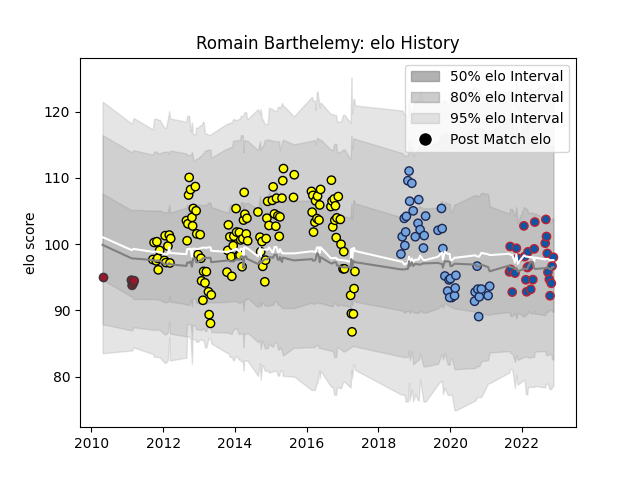

---  
layout: page  
title: Romain Barthelemy  
date: 2023-01-13 11:39:05.535159  
categories: player  
---
# Romain Barthelemy

## Positions: FH, C

## Current elo: 106.0

## Current Percentile: 60.0

# Elo History

# Match History

| Team     |   Appearances |   Win Rate |
|:---------|--------------:|-----------:|
| Albi     |           136 |   0.477941 |
| Bayonne  |            50 |   0.53     |
| Grenoble |            34 |   0.485294 |
| Toulon   |             5 |   0.6      |

| Opponent             |   Matches |   Win Rate |
|:---------------------|----------:|-----------:|
| Aurillac             |        15 |   0.633333 |
| Beziers              |        15 |   0.4      |
| Carcassonne          |        14 |   0.607143 |
| Agen                 |        11 |   0.545455 |
| Narbonne             |        10 |   0.6      |
| Provence Rugby       |        10 |   0.35     |
| Dax                  |         9 |   0.722222 |
| Bourgoin-Jallieu     |         9 |   0.888889 |
| Pau                  |         9 |   0.222222 |
| La Rochelle          |         8 |   0.375    |
| Mont-de-Marsan       |         8 |   0        |
| Oyonnax              |         8 |   0.25     |
| Brive                |         7 |   0.5      |
| Colomiers            |         7 |   0.642857 |
| Tarbes               |         6 |   0.333333 |
| US Bressane          |         6 |   0.833333 |
| Auch                 |         6 |   0.583333 |
| Vannes               |         6 |   0.333333 |
| Lyon                 |         6 |   0.166667 |
| Massy                |         5 |   1        |
| Perpignan            |         5 |   0.4      |
| Biarritz Olympique   |         5 |   0.2      |
| Soyaux-Angouleme     |         5 |   0.6      |
| Montauban            |         5 |   0.4      |
| Nevers               |         5 |   0.7      |
| Bayonne              |         4 |   0.25     |
| Montpellier Herault  |         3 |   0.666667 |
| Rouen                |         3 |   0.666667 |
| Clermont Auvergne    |         3 |   0.333333 |
| Castres Olympique    |         2 |   0.5      |
| Périgueux            |         2 |   0.5      |
| Stade Francais Paris |         2 |   1        |
| Toulon               |         2 |   0        |
| Bordeaux Begles      |         1 |   0        |
| Scarlets             |         1 |   0        |
| Stade Toulousain     |         1 |   1        |
| Racing 92            |         1 |   1        |