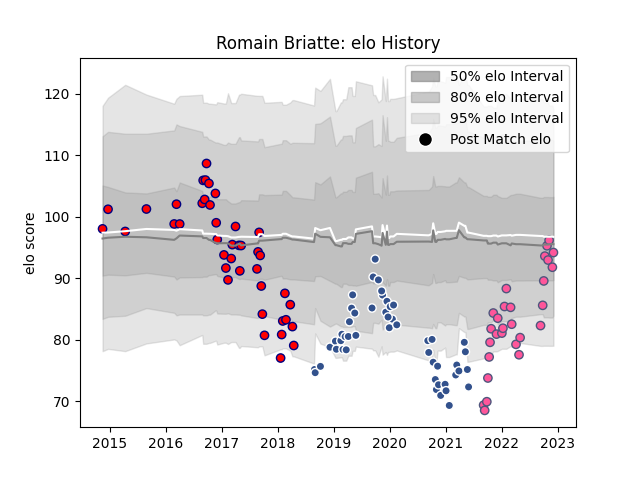

---  
layout: page  
title: Romain Briatte  
date: 2022-12-12 15:04:37.752940  
categories: player  
---
# Romain Briatte

## Positions: FL

## Current elo: 94.0

## Current Percentile: 34.0

# Elo History

# Match History

| Team                 |   Appearances |   Win Rate |
|:---------------------|--------------:|-----------:|
| Agen                 |            50 |   0.18     |
| Aurillac             |            41 |   0.45122  |
| Stade Francais Paris |            28 |   0.446429 |

| Opponent             |   Matches |   Win Rate |
|:---------------------|----------:|-----------:|
| Perpignan            |         8 |   0.75     |
| Castres Olympique    |         7 |   0.142857 |
| Bordeaux Begles      |         7 |   0        |
| Stade Toulousain     |         6 |   0.25     |
| Lyon                 |         6 |   0.333333 |
| Montpellier Herault  |         5 |   0.2      |
| Colomiers            |         5 |   0.4      |
| Clermont Auvergne    |         5 |   0.2      |
| La Rochelle          |         5 |   0.6      |
| Pau                  |         5 |   0.2      |
| Racing 92            |         5 |   0        |
| Toulon               |         5 |   0.4      |
| Bayonne              |         5 |   0.2      |
| Beziers              |         4 |   0.5      |
| Stade Francais Paris |         4 |   0.25     |
| Narbonne             |         3 |   0.666667 |
| Mont-de-Marsan       |         3 |   0.666667 |
| Dax                  |         3 |   0.666667 |
| Soyaux-Angouleme     |         3 |   0.333333 |
| Albi                 |         3 |   0.333333 |
| Grenoble             |         3 |   0.333333 |
| Brive                |         3 |   0.333333 |
| Biarritz Olympique   |         3 |   0.333333 |
| Montauban            |         2 |   0.75     |
| Edinburgh            |         2 |   0        |
| Tarbes               |         2 |   0.5      |
| Vannes               |         2 |   0.5      |
| Agen                 |         1 |   0        |
| Carcassonne          |         1 |   1        |
| Bristol Rugby        |         1 |   0        |
| Benetton Treviso     |         1 |   0        |
| Harlequins           |         1 |   0        |