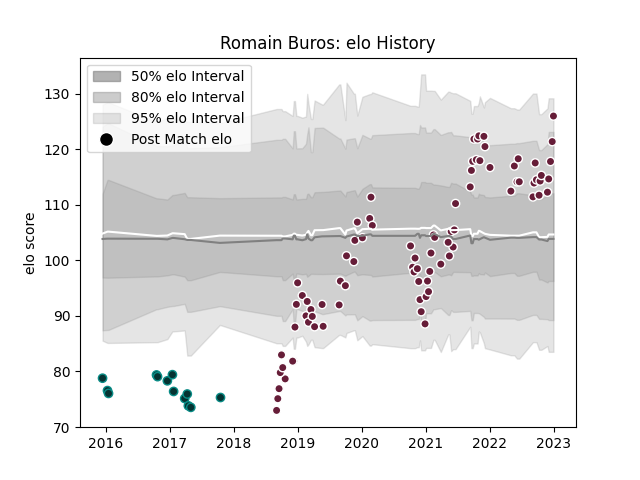

---  
layout: page  
title: Romain Buros  
date: 2022-12-14 11:29:26.375331  
categories: player  
---
# Romain Buros

## Positions: FB, W

## Current elo: 112.0

## Current Percentile: 81.0

# Elo History

# Match History

| Team            |   Appearances |   Win Rate |
|:----------------|--------------:|-----------:|
| Bordeaux Begles |            81 |   0.58642  |
| Pau             |            13 |   0.153846 |

| Opponent             |   Matches |   Win Rate |
|:---------------------|----------:|-----------:|
| Clermont Auvergne    |         8 |   0.75     |
| Racing 92            |         8 |   0.625    |
| Montpellier Herault  |         7 |   0.428571 |
| Stade Toulousain     |         7 |   0.285714 |
| Castres Olympique    |         7 |   0.785714 |
| Lyon                 |         7 |   0.571429 |
| Stade Francais Paris |         6 |   0.5      |
| Perpignan            |         6 |   0.583333 |
| La Rochelle          |         6 |   0.166667 |
| Agen                 |         4 |   0.75     |
| Brive                |         4 |   0.75     |
| Bayonne              |         3 |   0.666667 |
| Toulon               |         3 |   0.666667 |
| Sale Sharks          |         3 |   0.333333 |
| Pau                  |         2 |   0.5      |
| Grenoble             |         2 |   0.5      |
| Bath Rugby           |         2 |   0        |
| Gloucester Rugby     |         2 |   0.5      |
| Cardiff Blues        |         2 |   0        |
| Edinburgh            |         1 |   0.5      |
| Dragons              |         1 |   0        |
| Bristol Rugby        |         1 |   0        |
| Biarritz Olympique   |         1 |   1        |
| Wasps                |         1 |   1        |