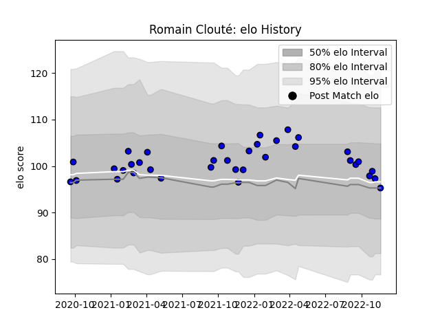

---  
layout: page  
title: Romain Clouté  
date: 2022-12-14 11:24:01.479018  
categories: player  
---
# Romain Clouté

## Positions: FB

## Current elo: 90.0

## Current Percentile: 39.0

# Elo History

# Match History

| Team   |   Appearances |   Win Rate |
|:-------|--------------:|-----------:|
| Massy  |            38 |   0.578947 |

| Opponent                   |   Matches |   Win Rate |
|:---------------------------|----------:|-----------:|
| Bourgoin-Jallieu           |         3 |   0.666667 |
| Chambery                   |         3 |   0.666667 |
| Aubenas                    |         3 |   1        |
| Albi                       |         2 |   0.5      |
| Blagnac                    |         2 |   0.5      |
| Cognac Saint Jean d'Angély |         2 |   1        |
| Tarbes                     |         2 |   1        |
| Dax                        |         2 |   1        |
| Dijon                      |         2 |   0.5      |
| Suresnes                   |         2 |   1        |
| Nice                       |         2 |   0        |
| Soyaux-Angouleme           |         2 |   0.5      |
| Rouen                      |         1 |   0        |
| Valence Romans Drome Rugby |         1 |   1        |
| US Bressane                |         1 |   0        |
| Mont-de-Marsan             |         1 |   1        |
| Provence Rugby             |         1 |   1        |
| Oyonnax                    |         1 |   0        |
| Montauban                  |         1 |   0        |
| Colomiers                  |         1 |   0        |
| Biarritz Olympique         |         1 |   0        |
| Aurillac                   |         1 |   0        |
| Vannes                     |         1 |   0        |