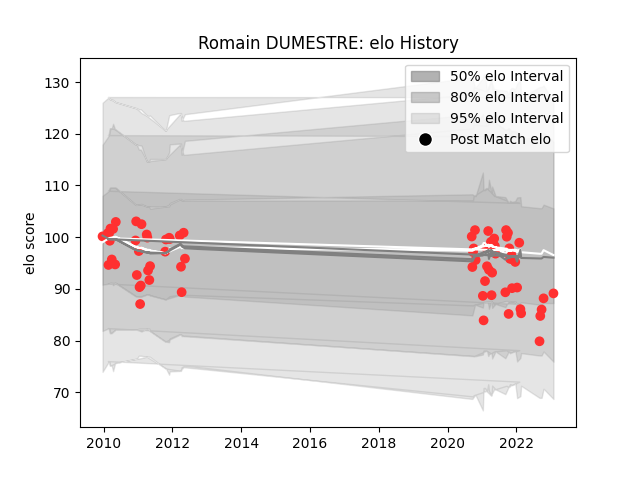

---  
layout: page  
title: Romain DUMESTRE  
date: 2023-01-30 18:31:18.085233  
categories: player  
---
# Romain DUMESTRE

## Positions: W, FB

## Current elo: 89.0

## Current Percentile: 27.0

# Elo History

# Match History

| Team   |   Appearances |   Win Rate |
|:-------|--------------:|-----------:|
| Tarbes |            71 |   0.492958 |

| Opponent                   |   Matches |   Win Rate |
|:---------------------------|----------:|-----------:|
| Narbonne                   |         6 |   0.666667 |
| Dax                        |         6 |   0.5      |
| Bourgoin-Jallieu           |         4 |   0.75     |
| Cognac Saint Jean d'Angély |         4 |   0.875    |
| Albi                       |         4 |   0.25     |
| Massy                      |         4 |   0.25     |
| Grenoble                   |         3 |   0        |
| Chambery                   |         3 |   0        |
| Colomiers                  |         3 |   0.166667 |
| Dijon                      |         3 |   0.5      |
| Lyon                       |         2 |   0.5      |
| US Bressane                |         2 |   0.5      |
| Suresnes                   |         2 |   0.5      |
| Soyaux-Angouleme           |         2 |   0.5      |
| Rennes                     |         2 |   1        |
| Nice                       |         2 |   0.25     |
| Agen                       |         2 |   0.5      |
| La Rochelle                |         2 |   0.5      |
| Bordeaux Begles            |         2 |   0.5      |
| Aurillac                   |         2 |   0.5      |
| Auch                       |         2 |   0.5      |
| Aubenas                    |         2 |   0.5      |
| Blagnac                    |         1 |   1        |
| Pau                        |         1 |   0        |
| Provence Rugby             |         1 |   1        |
| Périgueux                  |         1 |   1        |
| Beziers                    |         1 |   1        |
| Saint-Etienne              |         1 |   1        |
| Valence Romans Drome Rugby |         1 |   0        |