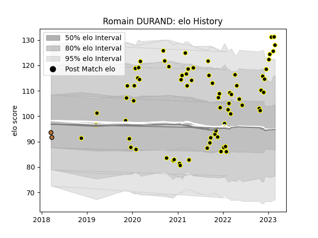

---  
layout: page  
title: Romain DURAND  
date: 2023-01-30 18:31:08.189905  
categories: player  
---
# Romain DURAND

## Positions: L

## Current elo: 120.0

## Current Percentile: 80.0

# Elo History

# Match History

| Team           |   Appearances |   Win Rate |
|:---------------|--------------:|-----------:|
| Mont-de-Marsan |            68 |   0.588235 |
| Narbonne       |             2 |   0        |

| Opponent                   |   Matches |   Win Rate |
|:---------------------------|----------:|-----------:|
| Aurillac                   |         7 |   0.857143 |
| Nevers                     |         6 |   0.333333 |
| Carcassonne                |         6 |   0.5      |
| Oyonnax                    |         6 |   0.416667 |
| Vannes                     |         6 |   0.333333 |
| Beziers                    |         5 |   0.8      |
| Provence Rugby             |         5 |   0.6      |
| Colomiers                  |         4 |   0.75     |
| Perpignan                  |         3 |   0.333333 |
| Rouen                      |         3 |   1        |
| Agen                       |         3 |   0.666667 |
| Grenoble                   |         2 |   0        |
| Massy                      |         2 |   0.5      |
| Montauban                  |         2 |   0.5      |
| Narbonne                   |         2 |   1        |
| Bayonne                    |         2 |   1        |
| Soyaux-Angouleme           |         2 |   0        |
| US Bressane                |         2 |   1        |
| Roval Drome XV             |         1 |   0        |
| Valence Romans Drome Rugby |         1 |   0.5      |