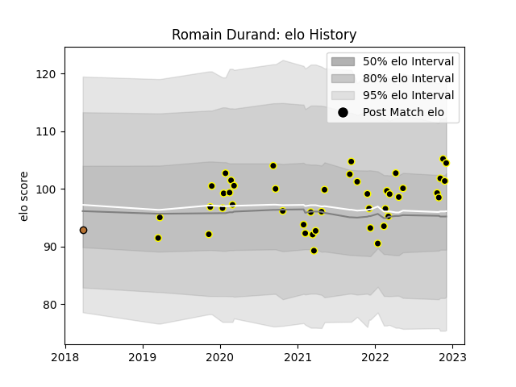

---  
layout: page  
title: Romain Durand  
date: 2022-11-22 11:30:08.471165  
categories: player  
---
# Romain Durand

## Positions: L

## Current elo: 102.0

## Current Percentile: 63.0

# Elo History

# Match History

| Team           |   Appearances |   Win Rate |
|:---------------|--------------:|-----------:|
| Mont-de-Marsan |            42 |    0.52381 |
| Narbonne       |             1 |    0       |

| Opponent                   |   Matches |   Win Rate |
|:---------------------------|----------:|-----------:|
| Provence Rugby             |         5 |   0.6      |
| Beziers                    |         5 |   0.8      |
| Nevers                     |         4 |   0        |
| Oyonnax                    |         4 |   0.375    |
| Colomiers                  |         3 |   0.666667 |
| Vannes                     |         3 |   0        |
| Carcassonne                |         3 |   0.333333 |
| Grenoble                   |         2 |   0        |
| Aurillac                   |         2 |   1        |
| Rouen                      |         2 |   1        |
| US Bressane                |         2 |   1        |
| Agen                       |         2 |   0.5      |
| Massy                      |         1 |   0        |
| Montauban                  |         1 |   1        |
| Perpignan                  |         1 |   1        |
| Bayonne                    |         1 |   1        |
| Soyaux-Angouleme           |         1 |   0        |
| Valence Romans Drome Rugby |         1 |   0.5      |