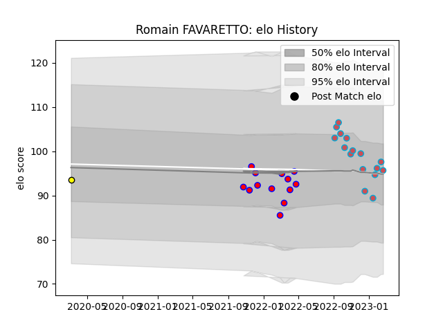

---  
layout: page  
title: Romain FAVARETTO  
date: 2023-02-06 11:15:51.552204  
categories: player  
---
# Romain FAVARETTO

## Positions: P

## Current elo: 87.0

## Current Percentile: 19.0

# Elo History

# Match History

| Team             |   Appearances |   Win Rate |
|:-----------------|--------------:|-----------:|
| Bourgoin-Jallieu |            14 |   0.5      |
| Blagnac          |            13 |   0.384615 |
| Carcassonne      |             1 |   0        |

| Opponent                   |   Matches |   Win Rate |
|:---------------------------|----------:|-----------:|
| Albi                       |         3 |   0        |
| Dax                        |         3 |   0.333333 |
| Tarbes                     |         3 |   0.666667 |
| Bourgoin-Jallieu           |         2 |   0.5      |
| Carqueiranne-Hyères        |         2 |   1        |
| Narbonne                   |         2 |   0.5      |
| Nice                       |         2 |   1        |
| Soyaux-Angouleme           |         2 |   0        |
| Suresnes                   |         2 |   0        |
| Valence Romans Drome Rugby |         2 |   0.5      |
| Aubenas                    |         1 |   1        |
| Aurillac                   |         1 |   0        |
| Blagnac                    |         1 |   0        |
| Rennes                     |         1 |   1        |
| US Bressane                |         1 |   0        |