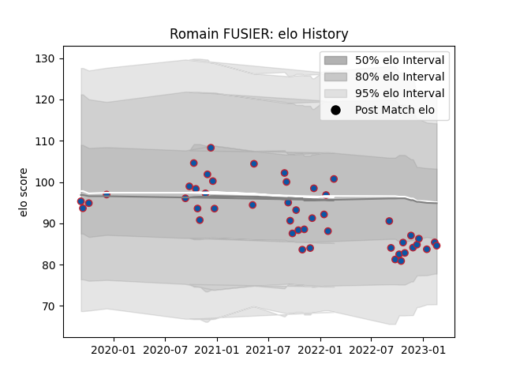

---  
layout: page  
title: Romain FUSIER  
date: 2023-02-24 09:53:04.196334  
categories: player  
---
# Romain FUSIER

## Positions: C

## Current elo: 85.0

## Current Percentile: 19.0

# Elo History

# Match History

| Team     |   Appearances |   Win Rate |
|:---------|--------------:|-----------:|
| Grenoble |            47 |   0.531915 |

| Opponent                   |   Matches |   Win Rate |
|:---------------------------|----------:|-----------:|
| Vannes                     |         5 |   0.4      |
| Aurillac                   |         5 |   0.6      |
| Rouen                      |         5 |   0.8      |
| Colomiers                  |         4 |   0.25     |
| Provence Rugby             |         3 |   0.333333 |
| Carcassonne                |         3 |   0.5      |
| Mont-de-Marsan             |         3 |   0.666667 |
| Soyaux-Angouleme           |         2 |   0.5      |
| Oyonnax                    |         2 |   0        |
| Agen                       |         2 |   1        |
| Montauban                  |         2 |   0.75     |
| Beziers                    |         2 |   0        |
| Bayonne                    |         2 |   0.5      |
| Nevers                     |         1 |   1        |
| Massy                      |         1 |   1        |
| Perpignan                  |         1 |   0        |
| Biarritz Olympique         |         1 |   0        |
| Roval Drome XV             |         1 |   1        |
| Valence Romans Drome Rugby |         1 |   1        |
| Narbonne                   |         1 |   1        |