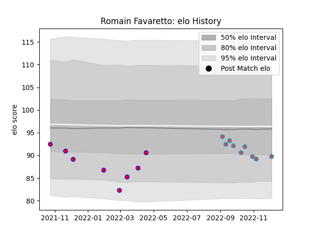

---  
layout: page  
title: Romain Favaretto  
date: 2022-12-09 13:22:32.912104  
categories: player  
---
# Romain Favaretto

## Positions: P

## Current elo: 90.0

## Current Percentile: 23.0

# Elo History

# Match History

| Team             |   Appearances |   Win Rate |
|:-----------------|--------------:|-----------:|
| Bourgoin-Jallieu |             9 |   0.444444 |
| Blagnac          |             8 |   0.25     |

| Opponent                   |   Matches |   Win Rate |
|:---------------------------|----------:|-----------:|
| Bourgoin-Jallieu           |         2 |        0.5 |
| Dax                        |         2 |        0.5 |
| Soyaux-Angouleme           |         2 |        0   |
| Suresnes                   |         2 |        0   |
| Albi                       |         1 |        0   |
| Aubenas                    |         1 |        1   |
| Blagnac                    |         1 |        0   |
| Carqueiranne-Hyères        |         1 |        1   |
| Narbonne                   |         1 |        1   |
| Nice                       |         1 |        1   |
| Tarbes                     |         1 |        0   |
| US Bressane                |         1 |        0   |
| Valence Romans Drome Rugby |         1 |        0   |