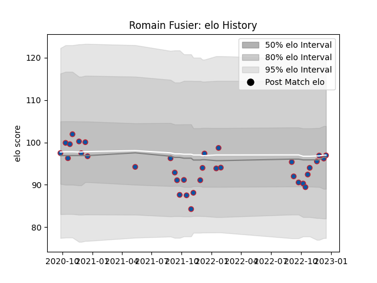

---  
layout: page  
title: Romain Fusier  
date: 2022-11-22 11:45:36.574665  
categories: player  
---
# Romain Fusier

## Positions: C

## Current elo: 95.0

## Current Percentile: 43.0

# Elo History

# Match History

| Team     |   Appearances |   Win Rate |
|:---------|--------------:|-----------:|
| Grenoble |            32 |   0.453125 |

| Opponent                   |   Matches |   Win Rate |
|:---------------------------|----------:|-----------:|
| Vannes                     |         4 |   0.25     |
| Rouen                      |         3 |   0.666667 |
| Mont-de-Marsan             |         2 |   1        |
| Provence Rugby             |         2 |   0        |
| Oyonnax                    |         2 |   0        |
| Aurillac                   |         2 |   0.5      |
| Montauban                  |         2 |   0.75     |
| Agen                       |         2 |   1        |
| Colomiers                  |         2 |   0        |
| Beziers                    |         2 |   0        |
| Bayonne                    |         2 |   0.5      |
| Carcassonne                |         1 |   0        |
| Nevers                     |         1 |   1        |
| Biarritz Olympique         |         1 |   0        |
| Perpignan                  |         1 |   0        |
| Soyaux-Angouleme           |         1 |   1        |
| Valence Romans Drome Rugby |         1 |   1        |
| Narbonne                   |         1 |   1        |