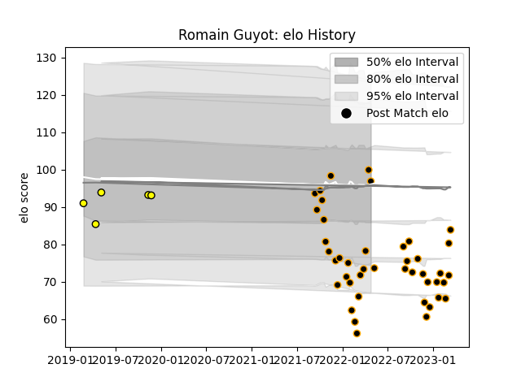

---  
layout: page  
title: Romain Guyot  
date: 2022-12-18 16:34:32.448051  
categories: player  
---
# Romain Guyot

## Positions: L, FL

## Current elo: 80.0

## Current Percentile: 6.0

# Elo History

# Match History

| Team        |   Appearances |   Win Rate |
|:------------|--------------:|-----------:|
| Chambery    |            29 |   0.413793 |
| Carcassonne |             2 |   0        |

| Opponent                   |   Matches |   Win Rate |
|:---------------------------|----------:|-----------:|
| Albi                       |         3 |   0        |
| Blagnac                    |         3 |   0.333333 |
| Bourgoin-Jallieu           |         3 |   0.333333 |
| Cognac Saint Jean d'Angély |         3 |   0.666667 |
| Suresnes                   |         3 |   0.666667 |
| Soyaux-Angouleme           |         2 |   1        |
| Tarbes                     |         2 |   0.5      |
| Valence Romans Drome Rugby |         2 |   0.5      |
| Dax                        |         2 |   0        |
| Aubenas                    |         1 |   0        |
| Narbonne                   |         1 |   1        |
| Nice                       |         1 |   0        |
| Oyonnax                    |         1 |   0        |
| Dijon                      |         1 |   1        |
| Brive                      |         1 |   0        |
| US Bressane                |         1 |   0        |
| Massy                      |         1 |   0        |