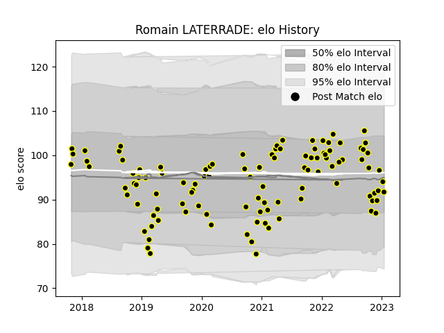

---  
layout: page  
title: Romain LATERRADE  
date: 2023-02-04 18:28:39.082293  
categories: player  
---
# Romain LATERRADE

## Positions: H

## Current elo: 76.0

## Current Percentile: 56.0

# Elo History

# Match History

| Team           |   Appearances |   Win Rate |
|:---------------|--------------:|-----------:|
| Mont-de-Marsan |           112 |   0.589286 |

| Opponent                   |   Matches |   Win Rate |
|:---------------------------|----------:|-----------:|
| Vannes                     |         9 |   0.333333 |
| Beziers                    |         8 |   0.625    |
| Provence Rugby             |         8 |   0.5      |
| Aurillac                   |         7 |   0.857143 |
| Oyonnax                    |         7 |   0.5      |
| Nevers                     |         7 |   0.428571 |
| Colomiers                  |         7 |   0.428571 |
| Rouen                      |         6 |   0.833333 |
| Montauban                  |         6 |   0.5      |
| Carcassonne                |         6 |   0.666667 |
| Grenoble                   |         5 |   0.6      |
| Perpignan                  |         5 |   0.4      |
| Biarritz Olympique         |         5 |   0.7      |
| Bayonne                    |         5 |   0.7      |
| Soyaux-Angouleme           |         5 |   0.6      |
| Massy                      |         4 |   0.75     |
| US Bressane                |         4 |   0.75     |
| Narbonne                   |         2 |   1        |
| Brive                      |         2 |   0.5      |
| Agen                       |         2 |   0.5      |
| Dax                        |         1 |   1        |
| Valence Romans Drome Rugby |         1 |   0.5      |