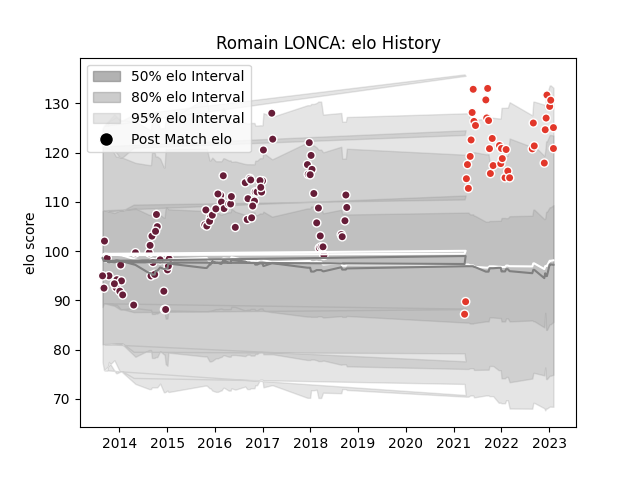

---  
layout: page  
title: Romain LONCA  
date: 2023-01-19 11:42:12.854012  
categories: player  
---
# Romain LONCA

## Positions: FB, C

## Current elo: 120.0

## Current Percentile: 89.0

# Elo History

# Match History

| Team               |   Appearances |   Win Rate |
|:-------------------|--------------:|-----------:|
| Bordeaux Begles    |            82 |   0.506098 |
| Biarritz Olympique |            31 |   0.403226 |

| Opponent             |   Matches |   Win Rate |
|:---------------------|----------:|-----------:|
| La Rochelle          |         8 |   0.625    |
| Lyon                 |         7 |   0.571429 |
| Stade Francais Paris |         7 |   0.428571 |
| Grenoble             |         7 |   0.5      |
| Clermont Auvergne    |         6 |   0.5      |
| Toulon               |         6 |   0.166667 |
| Montpellier Herault  |         6 |   0.166667 |
| Stade Toulousain     |         5 |   0.3      |
| Pau                  |         5 |   0.8      |
| Brive                |         5 |   0.4      |
| Castres Olympique    |         4 |   0.25     |
| Racing 92            |         4 |   0.75     |
| Exeter Chiefs        |         3 |   0.333333 |
| Agen                 |         3 |   1        |
| Perpignan            |         3 |   0        |
| Dragons              |         3 |   0.666667 |
| Bayonne              |         3 |   0.333333 |
| Oyonnax              |         3 |   0.666667 |
| Soyaux-Angouleme     |         2 |   1        |
| Mont-de-Marsan       |         2 |   0        |
| Bath Rugby           |         2 |   0        |
| Beziers              |         2 |   0        |
| Bordeaux Begles      |         2 |   0.5      |
| Montauban            |         1 |   1        |
| Aurillac             |         1 |   1        |
| Ulster               |         1 |   1        |
| Biarritz Olympique   |         1 |   1        |
| Rouen                |         1 |   1        |
| Colomiers            |         1 |   0        |
| RC Enisei            |         1 |   1        |
| Provence Rugby       |         1 |   1        |
| Edinburgh            |         1 |   0        |
| London Welsh         |         1 |   1        |
| Mogliano             |         1 |   1        |
| Ospreys              |         1 |   0        |
| Newcastle Falcons    |         1 |   0        |
| Nevers               |         1 |   1        |
| Vannes               |         1 |   0        |