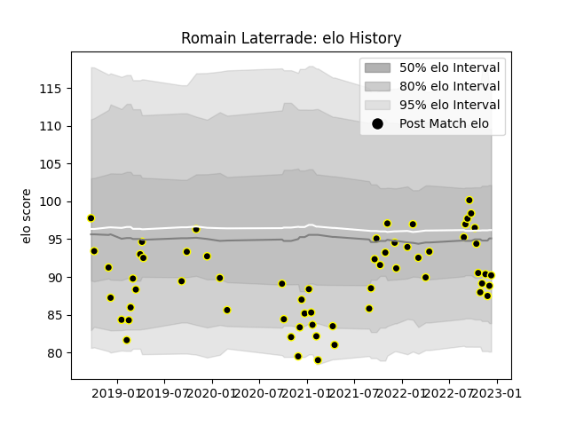

---  
layout: page  
title: Romain Laterrade  
date: 2022-11-22 11:36:38.847208  
categories: player  
---
# Romain Laterrade

## Positions: H

## Current elo: 91.0

## Current Percentile: 21.0

# Elo History

# Match History

| Team           |   Appearances |   Win Rate |
|:---------------|--------------:|-----------:|
| Mont-de-Marsan |            58 |   0.603448 |

| Opponent           |   Matches |   Win Rate |
|:-------------------|----------:|-----------:|
| Montauban          |         5 |   0.4      |
| Oyonnax            |         5 |   0.5      |
| Rouen              |         5 |   0.8      |
| Beziers            |         4 |   0.25     |
| Biarritz Olympique |         4 |   0.875    |
| Aurillac           |         4 |   1        |
| Bayonne            |         3 |   1        |
| Soyaux-Angouleme   |         3 |   1        |
| Colomiers          |         3 |   0.333333 |
| Grenoble           |         3 |   0.333333 |
| US Bressane        |         2 |   0.5      |
| Provence Rugby     |         2 |   0.5      |
| Perpignan          |         2 |   0        |
| Agen               |         2 |   0.5      |
| Nevers             |         2 |   0.5      |
| Narbonne           |         2 |   1        |
| Massy              |         2 |   0.5      |
| Carcassonne        |         2 |   0.5      |
| Brive              |         2 |   0.5      |
| Vannes             |         1 |   1        |