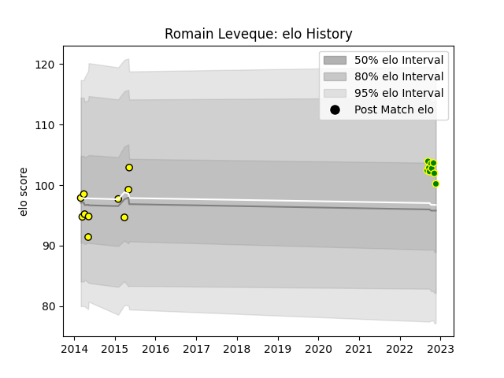

---  
layout: page  
title: Romain Leveque  
date: 2022-12-14 11:13:22.167668  
categories: player  
---
# Romain Leveque

## Positions: C, W

## Current elo: 101.0

## Current Percentile: 62.0

# Elo History

# Match History

| Team                |   Appearances |   Win Rate |
|:--------------------|--------------:|-----------:|
| Carqueiranne-Hyères |            11 |   0.272727 |
| Carcassonne         |            10 |   0.5      |

| Opponent                   |   Matches |   Win Rate |
|:---------------------------|----------:|-----------:|
| Albi                       |         2 |        1   |
| Tarbes                     |         2 |        0.5 |
| Narbonne                   |         2 |        0   |
| Agen                       |         1 |        0   |
| US Bressane                |         1 |        0   |
| Suresnes                   |         1 |        0   |
| Rennes                     |         1 |        0   |
| Pau                        |         1 |        1   |
| Nice                       |         1 |        0   |
| Mont-de-Marsan             |         1 |        0   |
| La Rochelle                |         1 |        0   |
| Dax                        |         1 |        1   |
| Colomiers                  |         1 |        1   |
| Cognac Saint Jean d'Angély |         1 |        1   |
| Bourgoin-Jallieu           |         1 |        0   |
| Blagnac                    |         1 |        0   |
| Beziers                    |         1 |        1   |
| Valence Romans Drome Rugby |         1 |        0   |