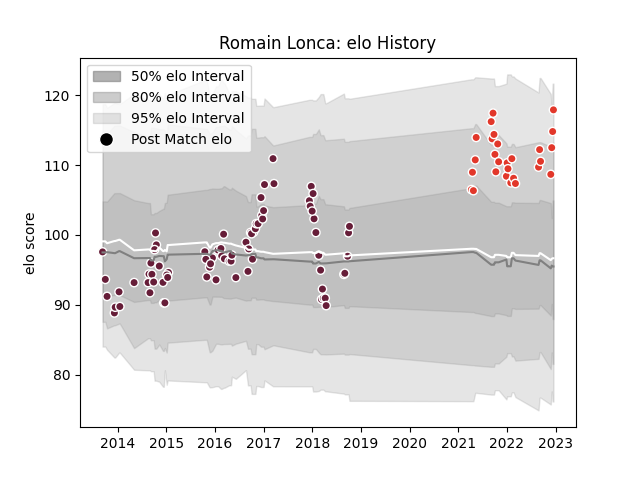

---  
layout: page  
title: Romain Lonca  
date: 2022-12-09 13:15:05.926472  
categories: player  
---
# Romain Lonca

## Positions: FB, C

## Current elo: 112.0

## Current Percentile: 81.0

# Elo History

# Match History

| Team               |   Appearances |   Win Rate |
|:-------------------|--------------:|-----------:|
| Bordeaux Begles    |            76 |   0.532895 |
| Biarritz Olympique |            25 |   0.38     |

| Opponent             |   Matches |   Win Rate |
|:---------------------|----------:|-----------:|
| La Rochelle          |         8 |   0.625    |
| Lyon                 |         7 |   0.571429 |
| Grenoble             |         7 |   0.5      |
| Toulon               |         6 |   0.166667 |
| Clermont Auvergne    |         6 |   0.5      |
| Pau                  |         5 |   0.8      |
| Stade Toulousain     |         5 |   0.3      |
| Stade Francais Paris |         5 |   0.4      |
| Brive                |         4 |   0.5      |
| Montpellier Herault  |         4 |   0.25     |
| Racing 92            |         4 |   0.75     |
| Agen                 |         3 |   1        |
| Perpignan            |         3 |   0        |
| Dragons              |         3 |   0.666667 |
| Exeter Chiefs        |         3 |   0.333333 |
| Castres Olympique    |         3 |   0.333333 |
| Bayonne              |         3 |   0.333333 |
| Oyonnax              |         3 |   0.666667 |
| Mont-de-Marsan       |         2 |   0        |
| Bordeaux Begles      |         2 |   0.5      |
| Bath Rugby           |         2 |   0        |
| Newcastle Falcons    |         1 |   0        |
| Ospreys              |         1 |   0        |
| Aurillac             |         1 |   1        |
| Mogliano             |         1 |   1        |
| London Welsh         |         1 |   1        |
| Provence Rugby       |         1 |   1        |
| RC Enisei            |         1 |   1        |
| Edinburgh            |         1 |   0        |
| Rouen                |         1 |   1        |
| Soyaux-Angouleme     |         1 |   1        |
| Biarritz Olympique   |         1 |   1        |
| Ulster               |         1 |   1        |
| Vannes               |         1 |   0        |