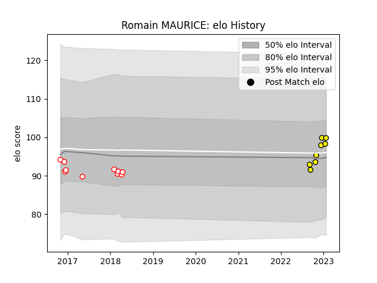

---  
layout: page  
title: Romain MAURICE  
date: 2023-01-27 19:01:27.532737  
categories: player  
---
# Romain MAURICE

## Positions: H

## Current elo: 100.0

## Current Percentile: None

# Elo History

# Match History

| Team   |   Appearances |   Win Rate |
|:-------|--------------:|-----------:|
| Dax    |            10 |       0.2  |
| Albi   |             8 |       0.75 |

| Opponent                   |   Matches |   Win Rate |
|:---------------------------|----------:|-----------:|
| Blagnac                    |         2 |        0.5 |
| Carcassonne                |         2 |        0   |
| Rennes                     |         2 |        1   |
| Albi                       |         1 |        0   |
| Aurillac                   |         1 |        0   |
| Beziers                    |         1 |        1   |
| Carqueiranne-Hyères        |         1 |        1   |
| Cognac Saint Jean d'Angély |         1 |        1   |
| Colomiers                  |         1 |        0   |
| Dax                        |         1 |        1   |
| Grenoble                   |         1 |        0   |
| Mont-de-Marsan             |         1 |        0   |
| Montauban                  |         1 |        0   |
| Suresnes                   |         1 |        0   |
| Vannes                     |         1 |        1   |