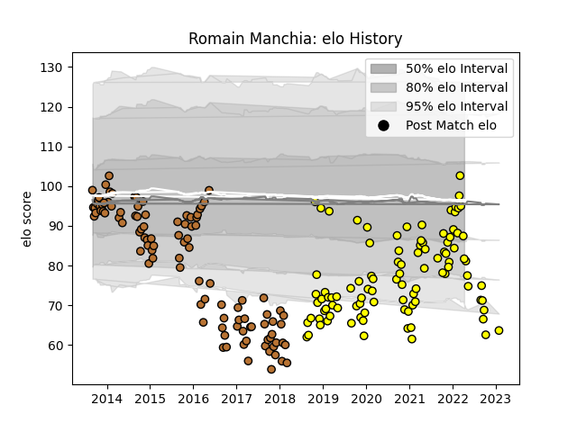

---  
layout: page  
title: Romain Manchia  
date: 2023-03-21 18:18:45.993879  
categories: player  
---
# Romain Manchia

Last updated: 2023-03-21
## Positions: L

## Current elo: 84.0

## Current Percentile: 15.0

# Elo History

# Match History

| Team        |   Appearances |   Win Rate |
|:------------|--------------:|-----------:|
| Carcassonne |           103 |   0.490291 |
| Narbonne    |           102 |   0.431373 |

| Opponent                   |   Matches |   Win Rate |
|:---------------------------|----------:|-----------:|
| Aurillac                   |        15 |   0.466667 |
| Montauban                  |        15 |   0.666667 |
| Beziers                    |        14 |   0.571429 |
| Biarritz Olympique         |        14 |   0.285714 |
| Mont-de-Marsan             |        14 |   0.5      |
| Colomiers                  |        12 |   0.333333 |
| Massy                      |         9 |   0.333333 |
| Nevers                     |         9 |   0.333333 |
| Vannes                     |         9 |   0.555556 |
| Provence Rugby             |         8 |   0.5      |
| Soyaux-Angouleme           |         8 |   0.6875   |
| Oyonnax                    |         8 |   0.125    |
| Bourgoin-Jallieu           |         7 |   0.571429 |
| Agen                       |         6 |   0.333333 |
| Albi                       |         6 |   0.416667 |
| Rouen                      |         6 |   0.833333 |
| Perpignan                  |         6 |   0        |
| Dax                        |         5 |   0.4      |
| Grenoble                   |         5 |   0.2      |
| Tarbes                     |         4 |   0.625    |
| Bayonne                    |         4 |   0.25     |
| Pau                        |         4 |   0.25     |
| US Bressane                |         3 |   1        |
| Carcassonne                |         3 |   0.666667 |
| Lyon                       |         3 |   0.666667 |
| Narbonne                   |         2 |   1        |
| Valence Romans Drome Rugby |         2 |   0        |
| Auch                       |         2 |   0.5      |
| Brive                      |         1 |   1        |
| La Rochelle                |         1 |   1        |