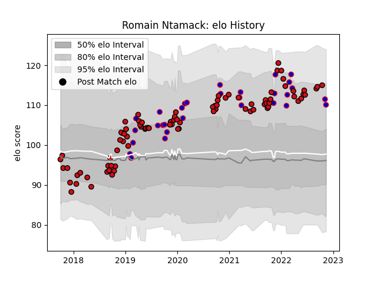

---  
layout: page  
title: Romain Ntamack  
date: 2023-01-13 11:24:02.018555  
categories: player  
---
# Romain Ntamack

## Positions: FH, C

## Country: France

## Current elo: 92.0

## Current Percentile: 83.0

# Elo History

# Match History

| Team             |   Appearances |   Win Rate |
|:-----------------|--------------:|-----------:|
| Stade Toulousain |            91 |   0.736264 |
| France           |            32 |   0.75     |

| Opponent                 |   Matches |   Win Rate |
|:-------------------------|----------:|-----------:|
| Clermont Auvergne        |         9 |   0.611111 |
| La Rochelle              |         7 |   0.857143 |
| Bordeaux Begles          |         7 |   0.857143 |
| Castres Olympique        |         7 |   0.428571 |
| Wales                    |         6 |   0.666667 |
| Toulon                   |         6 |   0.75     |
| Scotland                 |         6 |   0.5      |
| Lyon                     |         6 |   0.416667 |
| Racing 92                |         5 |   0.8      |
| Montpellier Herault      |         5 |   0.6      |
| England                  |         4 |   0.5      |
| Italy                    |         4 |   1        |
| Agen                     |         4 |   1        |
| Brive                    |         4 |   1        |
| Wasps                    |         3 |   0.666667 |
| Sale Sharks              |         3 |   0.833333 |
| Ireland                  |         3 |   0.666667 |
| Leinster                 |         3 |   0.333333 |
| Biarritz Olympique       |         2 |   1        |
| Perpignan                |         2 |   1        |
| Pau                      |         2 |   1        |
| Bath Rugby               |         2 |   1        |
| Cardiff Blues            |         2 |   0.5      |
| Argentina                |         2 |   1        |
| Connacht                 |         2 |   1        |
| Gloucester Rugby         |         2 |   1        |
| Stade Francais Paris     |         2 |   0.5      |
| South Africa             |         1 |   1        |
| Ulster                   |         1 |   1        |
| Tonga                    |         1 |   1        |
| United States of America |         1 |   1        |
| Australia                |         1 |   1        |
| Exeter Chiefs            |         1 |   0        |
| Bayonne                  |         1 |   1        |
| Georgia                  |         1 |   1        |
| New Zealand              |         1 |   1        |
| Munster                  |         1 |   1        |
| Japan                    |         1 |   1        |
| Grenoble                 |         1 |   1        |
| Oyonnax                  |         1 |   1        |