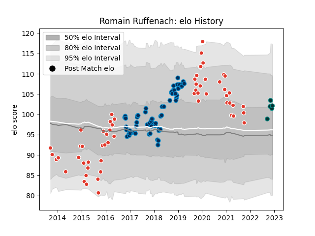

---  
layout: page  
title: Romain Ruffenach  
date: 2022-12-18 16:16:59.331849  
categories: player  
---
# Romain Ruffenach

## Positions: H

## Current elo: 103.0

## Current Percentile: 73.0

# Elo History

# Match History

| Team                |   Appearances |   Win Rate |
|:--------------------|--------------:|-----------:|
| Montpellier Herault |            64 |   0.5625   |
| Biarritz Olympique  |            58 |   0.482759 |
| Pau                 |             6 |   0.833333 |

| Opponent                   |   Matches |   Win Rate |
|:---------------------------|----------:|-----------:|
| Stade Toulousain           |         8 |   0.5      |
| La Rochelle                |         8 |   0.5      |
| Toulon                     |         6 |   0.666667 |
| Racing 92                  |         6 |   0.5      |
| Bordeaux Begles            |         6 |   0.666667 |
| Pau                        |         6 |   0.666667 |
| Grenoble                   |         5 |   0.8      |
| Perpignan                  |         5 |   0.2      |
| Lyon                       |         5 |   0.2      |
| Agen                       |         4 |   0.75     |
| Mont-de-Marsan             |         4 |   0.375    |
| Clermont Auvergne          |         4 |   0.75     |
| Castres Olympique          |         4 |   0.25     |
| Carcassonne                |         4 |   0.5      |
| Colomiers                  |         3 |   0.666667 |
| Montauban                  |         3 |   0.666667 |
| Tarbes                     |         3 |   0.333333 |
| Stade Francais Paris       |         3 |   0.333333 |
| Bourgoin-Jallieu           |         3 |   1        |
| Narbonne                   |         3 |   1        |
| Oyonnax                    |         3 |   0.666667 |
| Leinster                   |         3 |   0.333333 |
| Exeter Chiefs              |         2 |   0        |
| Nevers                     |         2 |   0        |
| Newcastle Falcons          |         2 |   0.5      |
| Dax                        |         2 |   1        |
| Brive                      |         2 |   0.5      |
| Glasgow Warriors           |         2 |   1        |
| Provence Rugby             |         2 |   0.25     |
| Aurillac                   |         2 |   0.5      |
| Albi                       |         1 |   0        |
| Vannes                     |         1 |   1        |
| Valence Romans Drome Rugby |         1 |   0        |
| Dragons                    |         1 |   1        |
| Bayonne                    |         1 |   1        |
| Rouen                      |         1 |   1        |
| Soyaux-Angouleme           |         1 |   0        |
| Sale Sharks                |         1 |   0        |
| Roval Drome XV             |         1 |   1        |
| Massy                      |         1 |   1        |
| Beziers                    |         1 |   0        |
| Northampton Saints         |         1 |   0        |
| Worcester Warriors         |         1 |   1        |